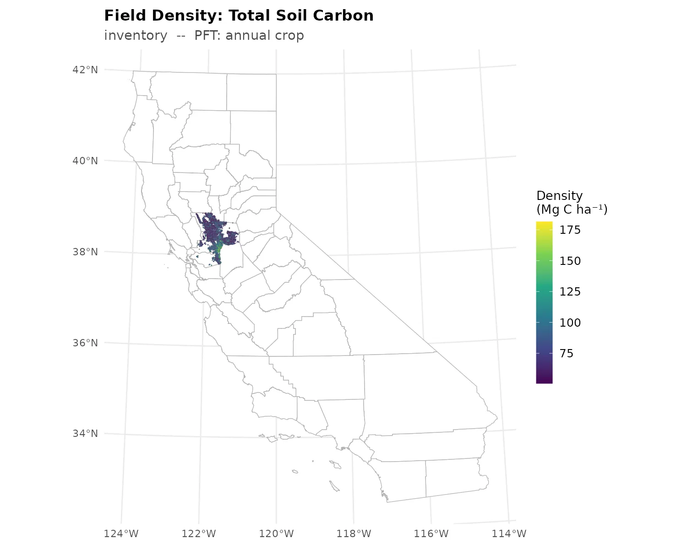
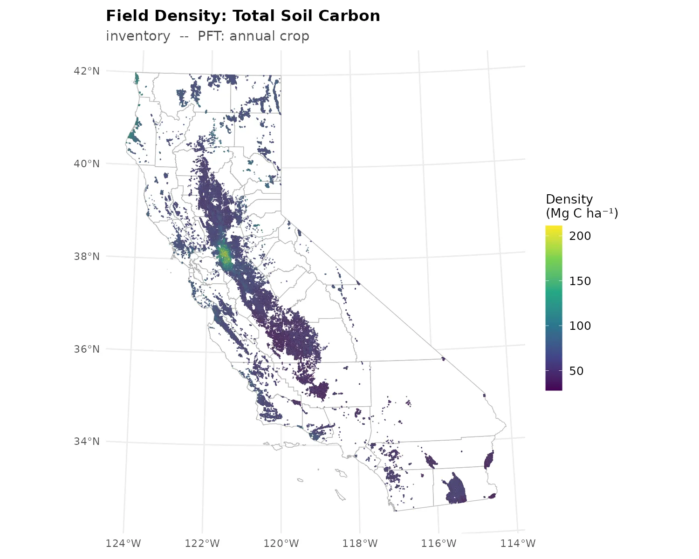

```{r setup, include=FALSE}
library(dplyr)
knitr::opts_chunk$set(echo = FALSE, message = FALSE, warning = FALSE)
# same run_dir the demo config uses, resolved from the repo root
run_dir <- here::here(params$run_dir)
ds <- file.path(run_dir, "output_downscale")
```

This session takes the output of a `magic-ensemble` inventory run and turns it into
carbon estimates for every crop field, then aggregates to county and state.

The demo bundle covers four Sacramento-San Joaquin Delta counties (Yolo, Solano,
Sacramento, Contra Costa) and trains from 99 design points spread across the whole
state. The full chain runs in about six minutes. Statewide numbers are at the end.

::: {.callout-note}
## Scope

The bundle ships data layers for four counties. A statewide run ships all 57 and uses
the same four commands -- the workflow predicts onto whatever fields the layers
contain, so this is a data scope, not a limit of the pipeline.
:::

For the concepts behind all of this -- why design points, how the Random Forest is
fit, what the covariates are -- see
[Intro to MAGiC Downscaling](../intro_to_downscaling.qmd)

This documentation assumes that the steps in
[Environment setup](CARB-downscaling-setup.md) have been completed. For a new shell,
follow its [Every new shell](CARB-downscaling-setup.md#every-new-shell) instructions.
Run all commands below from the downscaling repository root.

## Fetch demo data

```bash
./magic-downscaling get-demo-data --config example_user_config.yaml
cp demo-data/modelout/demo_config.yaml config.yaml
```

The bundle holds three things:

- `modelout/` -- SIPNET output, 99 design points x 10 ensemble members, 2016-2023,
  under `output_inventory/`
- `data/` -- field geometry, attributes, covariates and county boundaries for the four
  demo counties, plus covariates for the design points so the model can train
- `demo_config.yaml` -- a filled-in config, copied to `config.yaml` above

## Explore CLI layout

Execution is controlled by `magic-downscaling` and proceeds in four stages: staging
inputs, extracting model output, downscaling, and analysis.

```bash
./magic-downscaling -h
```

The commands are defined by the `steps` section of the workflow manifest:

```bash
less downscaling_manifest.yaml
```

Key points:

- Each command is a list of steps, each calling one script.
- All tuning happens through command-line arguments the CLI builds. Scripts never read
  environment variables for config.
- A step declares `inputs` (files), `outputs` (files) and `params` (everything else) as
  `{cli_flag: value_key}` pairs. The key is the literal flag the script expects.
- `inputs` and `outputs` values must be keys in the manifest's `paths` block, all
  relative to `run_dir`. That indirection is what lets you move a run without editing a
  script.
- `params` resolve from your config first, then `mode_params`, then `fixed_values`.
- `--verbose` reports the exact call issued for each step.

## Explore configuration file

```bash
less config.yaml
```

Everything you are likely to change lives here:

- `run_dir` -- where this run writes
- `mode` -- keep `production`. The other modes subsample: `demo` drops to one ensemble
  member and one year, `dev` to ten sites. The bundle is already small because of its
  data scope and does not need truncating as well.
- `management_scenarios` -- `inventory`. Must match the `output_<scenario>/` directory
  in the bundle.
- `outputs_to_extract` -- `TotSoilCarb`
- `pecan_output_dir`, `data_layers_dir` -- where the bundle is
- `n_cores`

## Prepare inputs

```bash
./magic-downscaling prepare --verbose --config config.yaml
```

- copies ensemble output and data layers into `run_dir`, so the run is self-contained
  and can be archived or moved
- fails immediately if a scenario in your config has no matching `output_<scenario>/`
  directory, which is the usual sign the config and the ensemble disagree

About 3 minutes.

## Extract SIPNET output

```bash
./magic-downscaling extract --verbose --config config.yaml
```

SIPNET writes one NetCDF per site, per member, per year at sub-daily resolution. This
reads them all, averages to monthly, and writes one long table in EFI format.

```{r extract-summary}
ens <- vroom::vroom(file.path(run_dir, "output_extract", "ensemble_output.csv"),
                    col_types = readr::cols(site_id = readr::col_character()),
                    progress = FALSE)
tibble::tibble(
  rows = format(nrow(ens), big.mark = ","),
  sites = dplyr::n_distinct(ens$site_id),
  members = dplyr::n_distinct(ens$parameter),
  months = dplyr::n_distinct(ens$datetime),
  variables = paste(sort(unique(ens$variable)), collapse = ", ")
) |>
  knitr::kable(caption = "ensemble_output.csv as written by `extract`")
```

The row count should be exactly `sites x members x months x variables`. If it is not,
something was dropped and it is worth finding out what before going on.

Values here are still in SIPNET units, kg C m^-2^ for pools. Conversion to
Mg C ha^-1^ happens in the next step. About 4 minutes.

## Downscale to fields

```bash
./magic-downscaling downscale --verbose --config config.yaml
```

For each PFT and carbon pool this:

- takes the design points that ran with that PFT as training data
- fits one Random Forest per ensemble member, covariates to model output
- predicts every field of that PFT, converts to reporting units, multiplies by area
- repeats at the start date so a change over the period can be formed
- aggregates to county and state

Fitting one forest per member is what carries the ensemble's parameter uncertainty
through to the field level instead of collapsing it to a single number.

```{r county-table}
readr::read_csv(file.path(ds, "county_aggregated_preds.csv"), show_col_types = FALSE) |>
  filter(model_output == "TotSoilCarb") |>
  transmute(county, pft, fields = n,
            `Mg C/ha` = round(mean_density_per_ha, 1),
            `Gg C` = round(mean_total_per_county / 1000),
            `ensemble SD %` = round(100 * sd_total_per_county / mean_total_per_county)) |>
  arrange(pft, desc(`Mg C/ha`)) |>
  knitr::kable(caption = "Soil carbon by county. The Delta counties sit above Yolo, which is the peat soils showing through.")
```

About 1.5 minutes.

## Check before you trust it

Two checks decide whether the maps are worth showing anyone.

A Random Forest cannot extrapolate past its training range, so predictions outside the
design points' range mean a broken join or a unit mismatch rather than a discovery.

Out-of-bag R^2^ says whether the forest learned anything at all:

```{r oob}
f <- list.files(ds, pattern = "^vi_.*by_ensemble.csv$", full.names = TRUE)
purrr::map_dfr(f, readr::read_csv, show_col_types = FALSE) |>
  distinct(pft, model_output, ensemble, oob_r2) |>
  summarize(members = n(),
            `median OOB R2` = round(median(oob_r2), 3),
            `members < 0` = sum(oob_r2 < 0),
            .by = c(pft, model_output)) |>
  arrange(model_output, pft) |>
  knitr::kable(caption = "Negative means the forest does worse than predicting the training mean.")
```

## Analyze the result!

```bash
./magic-downscaling analyze --verbose --config config.yaml
```

Writes diagnostics and maps to `figures/`: county and field maps per PFT and variable,
ALE and ICE curves for the strongest predictors, and a variable-importance summary.
About 1 minute.

```{r demo-map}
#| fig-cap: "Field-level soil carbon for the four demo counties, as written by `analyze`. The statewide frame shows where the demo scope sits."

```

For comparison, the same product from the full 1000-site statewide inventory. This is
what a production run delivers; the demo above is the same code on a smaller data scope.

```{r statewide-ref}
#| fig-cap: "Statewide field-level soil carbon, 1000 design points, 385,234 fields."

```

## The full inventory

Same four commands. What changes is the config and the machine.

```yaml
management_scenarios: [inventory]
outputs_to_extract: [TotSoilCarb]
n_cores: 8
pecan_output_dir: /path/to/your/magic-ensemble/output
data_layers_dir: /path/to/statewide/data_layers
```

| | Demo (4 counties) | Statewide |
|---|---|---|
| target fields | 23,311 | 385,234 |
| minimum RAM | 16 GB | 400 GB |
| cores used | 4 | 8 |
| download | 1.4 GB | your own ensemble output |
| run_dir on disk | ~6 GB | >100 GB |

Wall time depends on the machine, so treat the memory and disk figures as the binding
constraints. `downscale` is the step that sets them: its cost scales with target fields
and ensemble members, not with how many design points trained the forest, so a smaller
design does not make it cheaper.

`downscale` is the step to size carefully. Its cost is driven by target fields and
ensemble members, not by how many design points trained the forest, so it does not
shrink much with a smaller design. Request around 400 GB and do not run it on a login
node.

Also plan for disk: `prepare` copies `pecan_output_dir` into `run_dir`, and a statewide
ensemble output is well over 100 GB.

## Scenarios

Practice-change scenarios use the same four commands. The difference is that
`management_scenarios` lists several arms, the ensemble output carries one
`output_<scenario>/` directory per arm, and the analysis adds scenario-minus-baseline
comparisons; this session covers the inventory only.
