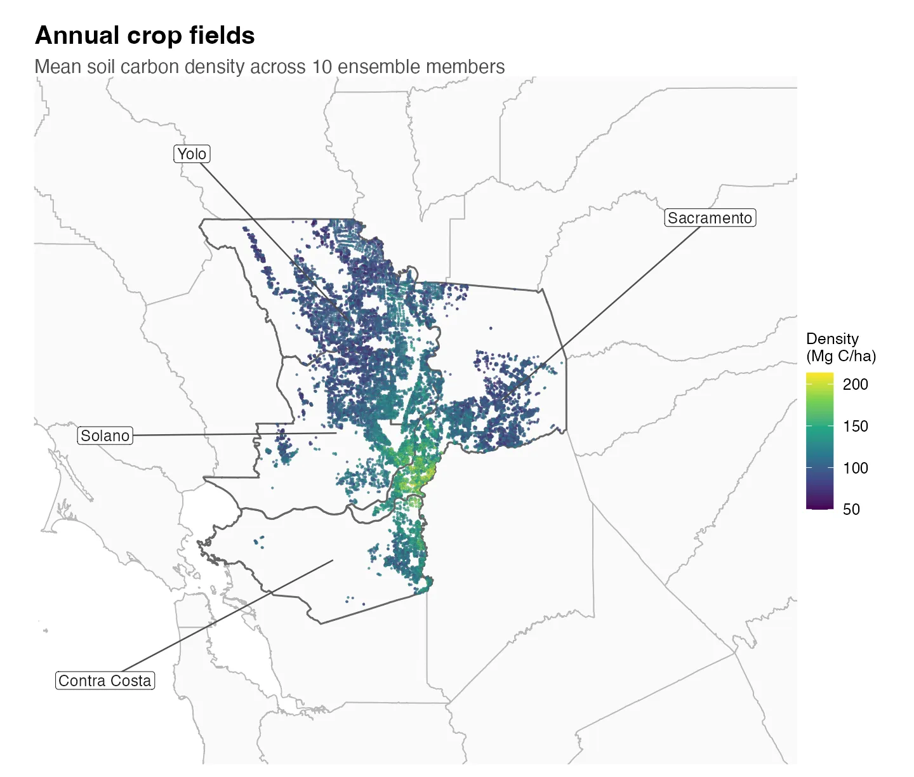
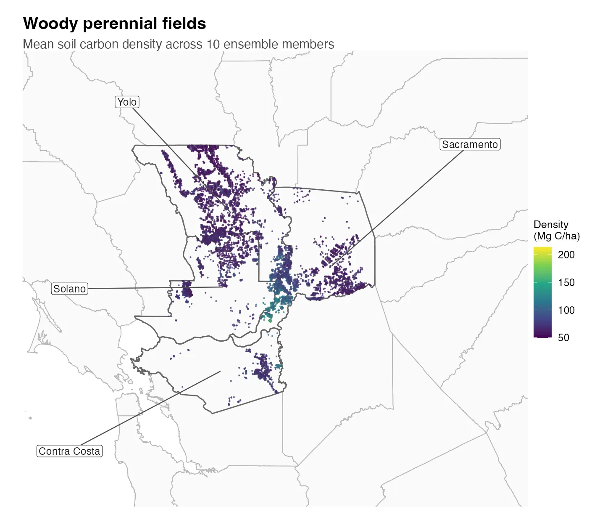

```{r setup, include=FALSE}
library(dplyr)
knitr::opts_chunk$set(echo = FALSE, message = FALSE, warning = FALSE)
# same run_dir the demo config uses, resolved from the repo root
run_dir <- here::here(params$run_dir)
ds <- file.path(run_dir, "output_downscale")

```

This tutorial demonstrates how to downscale output from a PEcAn ensemble run.
We used the magic-ensemble CLI to run SIPNET at a representative sample of fields from the CADWR Land Use dataset.

The downscaling step fits Random Forest models to the ensemble output at those sampled fields,
then predicts carbon stocks and greenhouse gas fluxes for target fields with the required covariates.
It aggregates the field-level predictions into county and run-scope summaries.

The demo covers four Sacramento–San Joaquin Delta counties: Yolo, Solano, Sacramento, and Contra Costa.
The demo inputs contain output for 100 design points distributed across California; the workflow uses these outputs to predict outcomes for fields within those four counties.
All 100 sites and 10 ensemble members have 96 monthly soil-carbon values in the verified demo.
Runtime depends on input scope and allocated computing resources.

::: {.callout-note}
## Scope

The demo dataset includes field data layers for these four Delta counties. Its
`state_summaries.csv` output therefore summarizes the four-county demo extent; **so the demo
'statewide' estimates only represent the four-county extent**.

:::

{fig-alt="After get-demo-data downloads the inputs: 1. prepare stages ensemble output and field data; 2. extract computes monthly means at design points; 3. downscale fits Random Forests per ensemble member, predicts target fields from covariates, repeats for the first month to estimate change, and aggregates by field area; 4. analyze creates diagnostics and maps." width=620}

For each plant functional type (PFT), output variable, and scenario, the workflow
fits one forest per ensemble member using the final available month's values at
the design points. It also fits forests for the first month to estimate change
over the simulation period.

This documentation assumes that the steps in
[Environment setup](CARB-downscaling-setup.md) have been completed. For a new shell,
follow its [Every new shell](CARB-downscaling-setup.md#every-new-shell) instructions.
Run all commands below from the downscaling repository root.

## Fetch demo data

```bash
./magic-downscaling get-demo-data --config example_user_config.yaml
cp demo-data/modelout/demo_config.yaml config.yaml
```


The data package contains:

- `modelout/` -- SIPNET output, 100 design points x 10 ensemble members, 2016-2023,
  under `output_inventory/`
- `data/` -- field geometry, attributes, covariates and county boundaries for the four
  demo counties, plus covariates for the design points so the model can train

### Inspect the inputs

Start with `config.yaml`: identify the model-output directory, data-layer directory,
scenario, output variable, and run directory. In the model-output directory,
`site_info.csv` identifies the design points and `output_inventory/out/` holds the
NetCDF files. In the data layers, `site_covariates.csv` supplies predictors;
`cadwr_crops_sites.gpkg` and `cadwr_crops_site_summary.csv` identify target fields.

For example, the supplied `output_inventory/out/ENS-00002-328163/2016.nc`
contains one location and 2,928 time steps. This excerpt from its NetCDF header
shows the soil-carbon variable and its units:

```text
dimensions:
    lon = 1 ;
    lat = 1 ;
    time = UNLIMITED ; // (2928 currently)
variables:
    double time(time) ;
        time:units = "days since 2016-01-01 00:00:00" ;
    double TotSoilCarb(time, lat, lon) ;
        TotSoilCarb:units = "kg C m-2" ;
        TotSoilCarb:_FillValue = -999. ;
        TotSoilCarb:long_name = "Total Soil Carbon" ;
```

The preview below reads the covariate table staged by `prepare`. `site_id` joins
these rows to the model output and field attributes. The numeric columns passed to the fitting routine
are shown beneath it; constant columns may be dropped when fitting a PFT.

```{r input-covariates}
input_covariates <- readr::read_csv(
    file.path(run_dir, "output_prepare", "site_covariates.csv"),
    col_types = readr::cols(site_id = readr::col_character()),
    show_col_types = FALSE
)
input_covariates |>
    select(any_of(c("site_id", "pft", "area_ha", "ocd", "temp", "tillage_rank"))) |>
    head(5) |>
    knitr::kable(caption = "Five rows from the supplied covariate table.")
input_covariates |>
    select(where(is.numeric), -any_of("climregion_id")) |>
    names() |>
    paste(collapse = ", ") |>
    strwrap(width = 80) |>
    writeLines()
```

### Covariates and design points

`site_covariates.csv` describes the fields where SIPNET was run and the fields
where predictions are needed. The workflow joins these data using `site_id`.

| Feature group | Columns | What they describe |
| --- | --- | --- |
| Climate | `temp`, `precip`, `srad`, `vapr` | Multi-year temperature, precipitation, solar radiation and atmospheric moisture summaries |
| Soil and terrain | `clay`, `ocd`, `twi` | Clay content, soil organic carbon density and topographic wetness |
| Crop history | `eof_*` | Principal components summarizing crop sequences across years; preparation retains up to 10 components |
| Phenology | `leafon_doy`, `leafoff_doy`, `leafon_doy_sd`, `leafoff_doy_sd` | Mean green-up and senescence day of year, and their variation across years |
| Tillage | `tillage_rank`, `tillage_freq` | Monitored tillage rank and fraction of monitored years with detected tillage |
| Irrigation | `irr_canopy`, `irr_flood` | Indicators derived from the monitored irrigation categories |

The clustering scripts use the seven climate, soil and terrain features plus
the crop-history, phenology and management columns present in the input table.
With 10 crop-history components and all eight phenology and management columns,
this is 25 clustering features.

Site selection groups fields separately within annual and woody perennial PFTs,
using standardized features and k-means clustering. It selects fields near the
cluster centers, then uses farthest point sampling to choose a smaller set that
represents the feature space.

The Random Forest predictor list is selected separately: `downscale` uses all
numeric columns of `site_covariates.csv` except `climregion_id`. These are used to fit the
Random Forest; `site_id` is key that joins the model output with the covariates.

## Explore CLI layout

Execution is controlled by `magic-downscaling` and proceeds in four stages: staging
inputs, extracting model output, downscaling, and analysis.

```bash
./magic-downscaling -h
```

The commands are defined by the `steps` section of the workflow manifest:

```bash
less downscaling_manifest.yaml
```

Key points:

- `extract`, `downscale`, and `analyze` are lists of steps, each calling one script.
- All tuning happens through command-line arguments the CLI builds. Scripts never read
  environment variables for config.
- A step declares `inputs` (files), `outputs` (files) and `params` (everything else) as
  `{cli_flag: value_key}` pairs. The key is the literal flag the script expects.
- `inputs` and `outputs` values must be keys in the manifest's `paths` block, all
  relative to `run_dir`. That indirection is what lets you move a run without editing a
  script.
- `params` resolve from your config first, then `mode_params`, then `fixed_values`.
- `--verbose` reports the exact call issued for each step.

## Explore configuration file

```bash
less config.yaml
```

The supplied configuration uses these values (set `n_cores` to your allocation):

```yaml
global:
  run_dir: inventory-run
  aws_profile: magic
downscaling:
  mode: production
  management_scenarios: [inventory]
  outputs_to_extract: [TotSoilCarb]
  n_cores: 1
  pecan_output_dir: demo-data/modelout
  data_layers_dir: demo-data/data
  anchor_site_locations: data_raw/anchor_site_locations.csv
```

Keep `mode: production` to use all sites, ensemble members, and years in this
small four-county dataset. By comparison, `demo` reads all sites for one member
and the final year, while `dev` reads the first 10 sites and members for the final
two years.
The `inventory` scenario matches the downloaded `output_inventory/` directory.
`outputs_to_extract` limits this walkthrough to `TotSoilCarb`.
`run_dir` controls where results are written; the two input-directory keys identify
the downloaded model outputs and data layers. Set `n_cores` to your allocated CPUs.

## Prepare inputs

```bash
./magic-downscaling prepare --verbose --config config.yaml
```

- copies ensemble output and data layers into `run_dir`, so the run is self-contained
  and can be archived or moved
- fails immediately if a scenario in your config has no matching `output_<scenario>/`
  directory, which is the usual sign the config and the ensemble disagree


## Extract SIPNET output

```bash
./magic-downscaling extract --verbose --config config.yaml
```

The PEcAn workflow writes one NetCDF per site, per member, per year at sub-daily resolution.
The `extract` step reads these, averages to monthly, and writes one long table in the EFI (Ecological Forecasting Initiative) standard format.
Each value is a monthly mean for one site, ensemble member, scenario and variable.
The subsequent RF fits select individual months from this table; they do not pool
the monthly time series into one training set.

```{r extract-summary}
ens <- vroom::vroom(file.path(run_dir, "output_extract", "ensemble_output.csv"),
    col_types = readr::cols(site_id = readr::col_character()),
    progress = FALSE
)
tibble::tibble(
    rows = format(nrow(ens), big.mark = ","),
    sites = dplyr::n_distinct(ens$site_id),
    members = dplyr::n_distinct(ens$parameter),
    months = dplyr::n_distinct(ens$datetime),
    variables = paste(sort(unique(ens$variable)), collapse = ", ")
) |>
    knitr::kable(caption = "ensemble_output.csv as written by `extract`")
```

For a complete table with one scenario and every combination present, the row count
is `sites x members x months x variables`. Check missing combinations and duplicate
keys before interpreting a difference from that count.

Values here are still in SIPNET units, kg C m^-2^ for pools. Conversion to
Mg C ha^-1^ happens in the next step.

## Downscale to fields

```bash
./magic-downscaling downscale --verbose --config config.yaml
```

For each PFT and carbon pool this:

- takes the design points that ran with that PFT as training data
- selects the final available month and fits one Random Forest per ensemble member,
  to that month's mean model output
- predicts every field of that PFT, converts to reporting units, multiplies by area
- repeats for the first month so a change between the two monthly means can be formed
- aggregates to county and state

Fitting one forest per member is what carries the ensemble's parameter uncertainty
through to the field level instead of collapsing it to a single number.

For each ensemble member, soil carbon density is converted to a field total:

`total_per_field (Mg C) = density_per_ha (Mg C/ha) × area_ha (ha)`.

Field totals are summed within each county and PFT. County density is the county
total divided by represented field area. The mean and standard deviation are then
computed across ensemble members.

| Output column | Meaning for soil carbon |
| --- | --- |
| `density_per_ha` | Field soil carbon density, Mg C/ha |
| `total_per_field` | Field soil carbon stock, Mg C |
| `mean_total_per_county` | Mean county stock across members, Mg C; the table below displays Gg C |
| `mean_density_per_ha` | Mean across members of area-weighted county density, Mg C/ha |
| `mean_total_ha` | Mean represented field area across members, ha |
| `sd_total_per_county` | Across-member SD of county stock, Mg C |
| `sd_density_per_ha` | Across-member SD of county density, Mg C/ha |

## Analyze and view results

```bash
./magic-downscaling analyze --verbose --config config.yaml
```

`analyze` writes diagnostics and maps to `figures/`, including county and field
maps, variable-importance summaries, and response curves for important predictors.

## Field results

To keep the table compact, it shows one example field per county and crop type.
Each example is the field closest to its group’s median ensemble-mean density.

```{r field-results}
field_predictions <- readr::read_csv(
    file.path(ds, "downscaled_preds.csv"),
    col_types = readr::cols(site_id = readr::col_character()),
    show_col_types = FALSE
)

field_results <- field_predictions |>
    filter(scenario == "inventory", model_output == "TotSoilCarb") |>
    summarize(
        county = first(county),
        crop_type = first(pft),
        area_ha = first(area_ha),
        density_mean = mean(density_per_ha),
        density_sd = sd(density_per_ha),
        stock_mean = mean(total_per_field),
        stock_sd = sd(total_per_field),
        .by = site_id
    )

example_fields <- field_results |>
    mutate(
        median_density = median(density_mean),
        distance_from_median = abs(density_mean - median_density),
        .by = c(county, crop_type)
    ) |>
    arrange(county, crop_type, distance_from_median, site_id) |>
    group_by(county, crop_type) |>
    slice_head(n = 1) |>
    ungroup()

format_significant <- function(x) {
    vapply(
        x,
        function(value) {
            format(
                signif(value, 2),
                big.mark = ",",
                scientific = FALSE,
                trim = TRUE
            )
        },
        character(1)
    )
}

example_fields |>
    transmute(
        `Field` = site_id,
        `County` = county,
        `Crop type` = recode(
            crop_type,
            "annual crop" = "Annual crop",
            "woody perennial crop" = "Woody perennial"
        ),
        `Area (ha)` = format_significant(area_ha),
        `Density mean (Mg C/ha)` = format_significant(density_mean),
        `Density SD (Mg C/ha)` = format_significant(density_sd),
        `Stock mean (Mg C)` = format_significant(stock_mean),
        `Stock SD (Mg C)` = format_significant(stock_sd)
    ) |>
    knitr::kable(
        caption = "One example field per county and crop type; values summarize 10 ensemble members."
    )
```

```{r annual-field-map}
#| fig-cap: "Ensemble-mean soil carbon density for annual-crop fields, in Mg C/ha. County names use leader lines; fields without covariates are not shown."

```

```{r woody-field-map}
#| fig-cap: "Ensemble-mean soil carbon density for woody-perennial fields, in Mg C/ha. County names use leader lines; both maps use the same color scale."

```

The table gives exact field examples, while the maps show how ensemble-mean
density varies among all predicted fields.

## County results

County stock is the sum of predicted field stocks within each ensemble member
and is then summarized across the 10 members.

```{r county-results, include=FALSE}
county_results <- field_predictions |>
    filter(scenario == "inventory", model_output == "TotSoilCarb") |>
    summarize(
        total_Mg_C = sum(total_per_field),
        field_count = n_distinct(site_id),
        .by = c(scenario, model_output, pft, county, ensemble)
    ) |>
    summarize(
        field_count = first(field_count),
        stock_mean_Gg_C = mean(total_Mg_C) / 1000,
        stock_sd_Gg_C = sd(total_Mg_C) / 1000,
        .by = c(scenario, model_output, pft, county)
    ) |>
    mutate(crop_type = recode(
        pft,
        "annual crop" = "Annual crop",
        "woody perennial crop" = "Woody perennial"
    )) |>
    arrange(crop_type, county)
```

```{r county-stock-plot}
#| fig-width: 7
#| fig-height: 5.5
#| fig-cap: "Points are mean county soil carbon stock in Gg C; bars show ±1 SD across 10 ensemble members. Both panels use the same scale."
ggplot2::ggplot(
    county_results,
    ggplot2::aes(x = county, y = stock_mean_Gg_C)
) +
    ggplot2::geom_errorbar(
        ggplot2::aes(
            ymin = pmax(0, stock_mean_Gg_C - stock_sd_Gg_C),
            ymax = stock_mean_Gg_C + stock_sd_Gg_C
        ),
        width = 0.15,
        color = "gray35"
    ) +
    ggplot2::geom_point(color = "#0072B2", size = 2.8) +
    ggplot2::facet_wrap(ggplot2::vars(crop_type), ncol = 1) +
    ggplot2::scale_y_continuous(labels = scales::label_comma()) +
    ggplot2::labs(x = NULL, y = "Soil carbon stock (Gg C)") +
    ggplot2::theme_minimal(base_size = 11) +
    ggplot2::theme(
        panel.grid.minor = ggplot2::element_blank(),
        strip.text = ggplot2::element_text(face = "bold")
    )
```

**[Download county statistics (CSV)](downloads/four_county_soil_carbon_by_county.csv){download="four_county_soil_carbon_by_county.csv"}**

```{r county-table}
county_results |>
    transmute(
        `County` = county,
        `Crop type` = crop_type,
        `Fields` = format(field_count, big.mark = ",", scientific = FALSE),
        `Stock mean (Gg C)` = format_significant(stock_mean_Gg_C),
        `Stock SD (Gg C)` = format_significant(stock_sd_Gg_C)
    ) |>
    knitr::kable(
        caption = "Total soil carbon stock represented by predicted fields; modeled values use two significant figures."
    )
```

SD describes spread across ensemble members; it is not a confidence interval.

## Model checks

Use these checks to confirm field coverage and how well the Random Forests
reproduce the SIPNET results at the design points.

**Coverage.** This run predicted 22,729 fields. Each field has values from all 10
ensemble members. Compare the range of predicted values
with the SIPNET values used for training; values far outside that range need review.

**Model fit.** Out-of-bag (OOB) R^2^ measures how well each forest predicts SIPNET
values left out during fitting. Higher values are better. Zero is no better than
using the average training value, and negative values are worse. This checks the
Random Forest, not SIPNET or the inventory against field measurements.

```{r oob}
f <- list.files(ds, pattern = "^vi_.*by_ensemble.csv$", full.names = TRUE)
oob_data <- purrr::map_dfr(f, readr::read_csv, show_col_types = FALSE) |>
    distinct(pft, model_output, ensemble, oob_r2) |>
    arrange(model_output, pft, ensemble)
oob_summary <- oob_data |>
    summarize(
        members = n(),
        median_oob_r2 = signif(median(oob_r2), 2),
        members_below_zero = sum(oob_r2 < 0),
        .by = c(pft, model_output)
    ) |>
    arrange(model_output, pft)
oob_summary |>
    transmute(
        `Crop type` = recode(
            pft,
            "annual crop" = "Annual crop",
            "woody perennial crop" = "Woody perennial"
        ),
        `Members` = members,
        `Median OOB R2` = median_oob_r2,
        `Members below zero` = members_below_zero
    ) |>
    knitr::kable(caption = "Random Forest fit across the 10 ensemble members.")
```

```{r oob-plot}
#| fig-width: 7
#| fig-height: 4.5
#| fig-cap: "Each point is one ensemble member. The dashed blue line is the PFT median; the solid gray line marks zero."
oob_plot_data <- oob_data |>
    mutate(pft = recode(
        pft,
        "annual crop" = "Annual crop",
        "woody perennial crop" = "Woody perennial crop"
    ))
oob_plot_medians <- oob_plot_data |>
    summarize(median_oob_r2 = median(oob_r2), .by = pft)

ggplot2::ggplot(oob_plot_data, ggplot2::aes(x = ensemble, y = oob_r2)) +
    ggplot2::geom_hline(yintercept = 0, color = "gray45", linewidth = 0.5) +
    ggplot2::geom_hline(
        data = oob_plot_medians,
        ggplot2::aes(yintercept = median_oob_r2),
        color = "#0072B2",
        linewidth = 0.7,
        linetype = "dashed"
    ) +
    ggplot2::geom_point(color = "#0072B2", size = 2.6) +
    ggplot2::facet_wrap(ggplot2::vars(pft), ncol = 1) +
    ggplot2::scale_x_continuous(breaks = seq_len(10)) +
    ggplot2::labs(
        x = "Ensemble member",
        y = expression("OOB " * R^2)
    ) +
    ggplot2::theme_minimal(base_size = 11) +
    ggplot2::theme(
        panel.grid.minor = ggplot2::element_blank(),
        strip.text = ggplot2::element_text(face = "bold")
    )
```

Median OOB R^2^ is 0.41 for annual crops and 0.31 for woody perennial crops. One
woody-perennial member falls below zero. These scores show how well the Random
Forests copy SIPNET at the design points; they do not show whether modeled soil
carbon agrees with measurements.

## Scaling beyond the demo

The same four commands can be used with a larger inventory. In the configuration,
set `mode: production`, point `pecan_output_dir` and `data_layers_dir` to the full
input directories using paths relative to the repository, and list the outputs to
process. Set `n_cores` to the CPUs in the compute allocation.

The four county demo used 10 ensemble members for 2016–2023. With 1 CPU and 28 GB of allocated memory, download and all four
stages finished in under 15 minutes; Slurm recorded about 1.15 GiB peak memory.

Treat these measurements as a starting point. Runtime and storage increase with
the numbers of fields, ensemble members, variables, and scenarios. The `prepare`
step also copies the input data into `run_dir`, so the run needs space for both
the source data and the staged copy.
