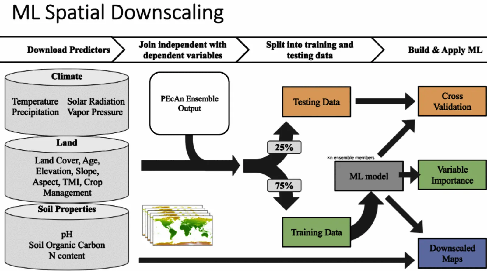

The downscaling workflow predicts carbon pools (Soil Organic Carbon and Aboveground Biomass) for cropland fields in California and then aggregates these predictions to the county scale.

It uses an ensemble-based approach to uncertainty propagation and analysis, maintaining ensemble structure to propagate errors through the prediction and aggregation processes.

{width="5in"}

## Terminology

- **Design Points**: Fields chosen via stratified random sampling using k-means clustering on environmental data layers across California crop fields.
- **Crop Fields**: All croplands in the LandIQ dataset.
- **Anchor Sites:** Sites used as ground truth for calibration and validation, including UC research stations and Ameriflux sites.

## This Repository Contains Two Workflows That Will Be Split

 TODO **Workflows (1 & 3) are in this repository and will be split**

The workflows are

1. **Site Selection**: uses environmental variables (later also management layers) to create clusters and then select representative sites. The design_points.csv are then passed to the ensemble workflow  
2. Ensemble in ccmmf/workflows repository, generates ensemble outputs
3. **Downscaling**: uses ensemble outputs to make predictions for each field in CA then aggregate to county level summaries.

<!--
TODO: Add workflow diagram; should be generated by Targets 
-->

## Workflow Steps

### Configuration

Workflow settings are configured in `000-config.R`.

The configuration script reads the CCMMF directory from the environment variable `CCMMF_DIR` (set in .Renviron), and uses it to define paths for inputs and outputs.

The `CCMMF_DIR` variable, however, is defined in `.Renviron` so that it can:
- Be used to locate and override R library (`RENV_PATHS_LIBRARY`) and cache (`RENV_PATHS_CACHE`) paths outside the home directory.
- Be easily overridden via a shell export (`export CCMMF_DIR=…`) without modifying workflow scripts.

#### Configuration setup


To set up this workflow to run on your system, follow the following steps.

**Clone Repository**

```sh
git clone git@github.com:ccmmf/downscaling
```

  - `CCMMF_DIR` should point to the shared CCMMF directory. 
    This is the location where data, inputs, and outputs will be stored, 
    as well as the location of the `renv` cache and library
  - `RENV_PATHS_CACHE` and `RENV_PATHS_LIBRARY` store the `renv` cache and library in the CCMMF directory.
    These are in a subdirectory of the CCMMF directory in order to make them available across all users 
    (and because on some computers, they exceed allocated space in the home directory).
  - `R_LIBS_USER` must point to the platform and R version specific subdirectory inside `RENV_PATHS_LIBRARY`.  
- `.Rprofile`
  - sets repositories from which R packages are installed
  - runs `renv/activate.R`
- `000-config.R`
  - set `pecan_outdir` based on the CCMMF_DIR.
  - confirm that relative paths (`data_raw`, `data`, `cache`) are correct.
  - detect and use resources for parallel processing (with future package); default is `available cores - 1`
  - PRODUCTION mode setting. For testing, set `PRODUCTION` to `FALSE`. This is _much_ faster and requires fewer computing resources because it subsets large datasets. Once a test run is successful, set `PRODUCTION` to `TRUE` to run the full workflow.

### 1. Data Preparation

```sh
Rscript scripts/009_update_landiq.R
Rscript scripts/010_prepare_covariates.R
Rscript scripts/011_prepare_anchor_sites.R
```

These scripts prepare data for clustering and downscaling:

- Converts LandIQ-derived shapefiles to a geopackage with geospatial information and a CSV with other attributes
- Extracts environmental covariates (clay, organic carbon, topographic wetness, temperature, precipitation, solar radiation, vapor pressure)
- Groups fields into Cal-Adapt climate regions
- Assigns anchor sites to fields

**Inputs:**

- **LandIQ Crop Map**: `data_raw/i15_Crop_Mapping_2016_SHP/i15_Crop_Mapping_2016.shp`
- **Soilgrids**: `clay_0-5cm_mean.tif` and `ocd_0-5cm_mean.tif`
  Consider aggregating 0-5,5-15,15-30 into a single 0-30 cm layer 
- **TWI**: `TWI/TWI_resample.tiff`
- **ERA5 Met Data**: Files in `GridMET/` folder named `ERA5_met_<YYYY>.tiff`
- **Anchor Sites**: `data_raw/anchor_sites.csv`

**Outputs:** 

- `ca_fields.gpkg`: Spatial information from LandIQ
- `ca_field_attributes.csv`: Site attributes including crop type
- `site_covariates.csv`: Environmental covariates for each field
- `anchor_sites_ids.csv`: Anchor site information


**Environmental Covariates**

| Variable | Description               | Source       | Units   |
| -------- | ------------------------- | ------------ | ------- |
| temp     | Mean annual temperature   | ERA5         | °C      |
| precip   | Mean annual precipitation | ERA5         | mm/year |
| srad     | Solar radiation           | ERA5         | W/m²    |
| vapr     | Vapor pressure deficit    | ERA5         | kPa     |
| clay     | Clay content              | SoilGrids    | %       |
| ocd      | Organic carbon density    | SoilGrids    | g/kg    |
| twi      | Topographic wetness index | SRTM-derived | -       |

### 2. Design Point Selection

```sh
Rscript scripts/020_cluster_and_select_design_points.R
Rscript scripts/021_clustering_diagnostics.R
```

Uses k-means clustering to select representative fields plus anchor sites:

- Subsample LandIQ fields and include anchor sites for clustering
- Select cluster number based on the Elbow Method
- Cluster fields using k-means based on environmental covariates
- Select design points from clusters for SIPNET simulation

**Inputs:**
- `data/site_covariates.csv`
- `data/anchor_sites_ids.csv`

**Output:** 
- `data/design_points.csv`

### 3. SIPNET Model Runs

A separate workflow prepares inputs and runs SIPNET simulations for the design points.

**Inputs:**
- `design_points.csv`
- Initial conditions (from modeling workflow)

**Outputs:**
- `out/ENS-<ensemble_number>-<site_id>/YYYY.nc`: NetCDF files containing SIPNET outputs, in PEcAn standard model output format. 
- `out/ENS-<ensemble_number>-<site_id>/YYYY.nc.var`: List of variables included in SIPNET output (see table below)

 **Available Variables**

Each output file named `YYYY.nc` has an associated file named `YYYY.nc.var`. 
This file contains a list of variables included in the output.
SIPNET outputs have been converted to PEcAn standard units and stored in PEcAn standard 
NetCDF files. 
PEcAn standard units are SI, following the Climate Forecasting standards: 

- Mass pools: kg / m2
  - TotSoilCarb: Total Soil Carbon
  - AbvGrndWood: Above ground woody biomass
- Mass fluxes: kg / m2 / s-1
  - GPP: Gross Primary Productivity
  - NPP: Net Primary Productivity
- Energy fluxes: W / m2
- Other: 
   - LAI: m2 / m2

 | Variable                     | Description                          |
 | ---------------------------- | ------------------------------------ |
 | GPP                          | Gross Primary Productivity           |
 | NPP                          | Net Primary Productivity             |
 | TotalResp                    | Total Respiration                    |
 | AutoResp                     | Autotrophic Respiration              |
 | HeteroResp                   | Heterotrophic Respiration            |
 | SoilResp                     | Soil Respiration                     |
 | NEE                          | Net Ecosystem Exchange               |
 | AbvGrndWood                  | Above ground woody biomass           |
 | leaf_carbon_content          | Leaf Carbon Content                  |
 | TotLivBiom                   | Total living biomass                 |
 | TotSoilCarb                  | Total Soil Carbon                    |
 | Qle                          | Latent heat                          |
 | Transp                       | Total transpiration                  |
 | SoilMoist                    | Average Layer Soil Moisture          |
 | SoilMoistFrac                | Average Layer Fraction of Saturation |
 | SWE                          | Snow Water Equivalent                |
 | litter_carbon_content        | Litter Carbon Content                |
 | litter_mass_content_of_water | Average layer litter moisture        |
 | LAI                          | Leaf Area Index                      |
 | fine_root_carbon_content     | Fine Root Carbon Content             |
 | coarse_root_carbon_content   | Coarse Root Carbon Content           |
 | GWBI                         | Gross Woody Biomass Increment        |
 | AGB                          | Total aboveground biomass            |
 | time_bounds                  | history time interval endpoints      |


### 4. Extract SIPNET Output

```sh
Rscript scripts/030_extract_sipnet_output.R
```

Extracts and formats SIPNET outputs for downscaling:

- Extract output variables (AGB, TotSoilCarb) from SIPNET simulations
- Aggregate site-level ensemble outputs into long and 4D array formats
- Save CSV and NetCDF files following EFI standards

**Inputs:**
- `out/ENS-<ensemble_number>-<site_id>/YYYY.nc`

**Outputs:**
- `out/ensemble_output.csv`: Long format data

### 5. Mixed Cropping Systems

```sh
Rscript scripts/031_aggregate_sipnet_output.R
```

Simulates mixed-cropping scenarios by combining outputs across two PFTs using a mixed aggregation function (see Mixed System Prototype). Two methods are supported:

- weighted: area-partitioned mix where `woody_cover + annual_cover = 1`
- incremental: preserve woody baseline (`woody_cover = 1`) and add the annual delta scaled by `annual_cover`

The current analysis uses the weighted method to represent ground cover in orchards and vineyards.

Outputs include `multi_pft_ensemble_output.csv`, `combined_ensemble_output.csv`, and `ensemble_output_with_mixed.csv` with a synthetic mixed PFT.

### 6. Downscale, Aggregate to County, and Plot

```sh
Rscript scripts/040_downscale.R
Rscript scripts/041_aggregate_to_county.R
Rscript scripts/042_downscale_analysis.R
Rscript scripts/043_county_level_plots.R
```

Builds Random Forest models to predict carbon pools for all fields; aggregates to county-level; summarizes variable importance; and produces maps:

- Train models on SIPNET ensemble runs at design points
- Use environmental covariates to downscale predictions to all fields
- Aggregate to county-level estimates
- Output maps and statistics of carbon density and totals

**Inputs:**
- `model_outdir/ensemble_output.csv`: SIPNET outputs extracted in step 4
- `data/site_covariates.csv`: Environmental covariates

**Outputs from `040_downscale.R`:**
- `model_outdir/downscaled_preds.csv`: Per-site, per-ensemble predictions with totals and densities
- `model_outdir/downscaled_preds_metadata.json`: Metadata for predictions
- `model_outdir/training_sites.csv`: Training site list per PFT and pool
- `cache/models/*_models.rds`: Saved RF models per spec
- `cache/training_data/*_training.csv`: Training covariate matrices per spec
- `model_outdir/downscaled_deltas.csv`: Optional start→end deltas when available

**Outputs from `041_aggregate_to_county.R`:**
- `model_outdir/county_summaries.csv`: County statistics (means/SDs across ensembles for stocks and densities)

**Outputs from `042_downscale_analysis.R` (saved in `figures/`):**
- `<pft>_<pool>_importance_partial_plots.png`: Variable importance with partial plots for top predictors
- `<pft>_<pool>_ALE_predictor<i>.svg` and `<pft>_<pool>_ICE_predictor<i>.svg`: ALE and ICE plots

**Outputs from `043_county_level_plots.R` (saved in `figures/`):**
- `county_<pft>_<pool>_carbon_stock.webp` and `county_<pft>_<pool>_carbon_density.webp`: County-level maps
- `county_diff_woody_plus_annual_minus_woody_<pool>_carbon_{density,stock}.webp`: Scenario difference maps
- `county_delta_<pft>_<pool>_carbon_{density,stock}.webp`: Start→end delta maps when available

## Running on BU Cluster

Interactive session (example):

```sh
qrsh -l h_rt=3:00:00 -pe omp 16 -l buyin
```

Submit a batch job (example using downscaling step):

```sh
qsub \
  -l h_rt=4:00:00 \
  -pe omp 8 \
  -o logs/040.out \
  -e logs/040.err \
  -b y Rscript scripts/040_downscale.R
```

## Documentation Site (Quarto)

- Preview: `quarto preview`
- Build: `quarto render`
- Publish to GitHub Pages: `quarto publish gh-pages` (publishes `_site/`)

Notes:
- Quarto config is in `_quarto.yml` and the home page is `index.qmd` (includes `README.md`).
- Uses `freeze: auto` to cache outputs; rebuild where data paths exist (see `000-config.R`).

## Technical Reference

### Ensemble Structure

Each ensemble member represents a plausible realization given parameter and meteorological uncertainty. This ensemble structure is maintained throughout the workflow to properly propagate uncertainty. For example, downscaling is done for each ensemble member separately, and then the results are aggregated to county-level statistics.