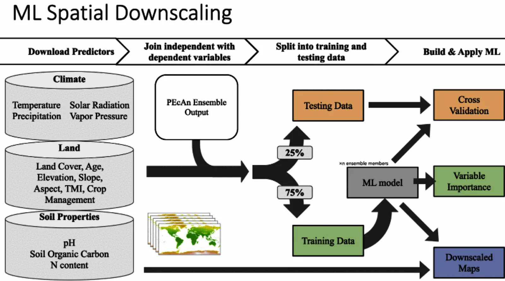

The downscaling workflow predicts carbon pools (Soil Organic Carbon and Aboveground Biomass) for cropland fields in California and then aggregates these predictions to the county scale.

It uses an ensemble-based approach to uncertainty propagation and analysis, maintaining ensemble structure to propagate errors through the prediction and aggregation processes.

{width="5in"}

## Terminology

<!-- TODO move to and curate a project level glossary (?) -->

- **Anchor Sites**: Sites with long observation records used as ground truth for calibration and validation, currently UC research stations and Ameriflux towers. Force-included in the design so they are simulated in SIPNET.
- **Clustered Sites**: The 10,000 row pool that `020_cluster_sites.R` writes. One representative per cluster (the field closest to the cluster center in scaled feature space). Frozen artifact, decoupled from the SIPNET compute budget.
- **Crop Fields**: All cropland parcels in the CADWR LandIQ Crop Map (harmonized LandIQ v4.1, ~550,000 rows after NAs in the cluster features are dropped). This dataset is referred to as the CADWR LandIQ Crop Map throughout.
- **Design Points**: The 1,000 row SIPNET runnable subset that `021_subsample_design_points.R` slices out of the 10k pool via farthest point sampling. `n_design` in `000-config.R` controls the size.
- **DOY**: Day of year (1 to 365).
- **EOF**: Empirical Orthogonal Function. PCA on the field by crop class by year one hot matrix from the CADWR LandIQ Crop Map. Compresses about 8 years of crop rotation history into 10 continuous features (`eof_1` through `eof_10`).
- **FPS**: Farthest Point Sampling, also called greedy maximin. Produces a nested ordering so any prefix is a valid space filling subset. Used in 021 to slice the 10k pool down to the 1k design (Pronzato and Müller 2012).
- **FSCS**: Feature Space Coverage Sampling. The general approach 020 uses: cluster the predictors, take one representative per cluster, fit the downstream model on those representatives (Wadoux, Brus and Heuvelink 2019).
- **k-means++**: k-means initialization that scatters the initial centers across the feature space, weighted by squared distance from already chosen centers. Used as the `initializer` argument in `ClusterR::KMeans_rcpp` (Arthur and Vassilvitskii 2007).
- **KS**: Kolmogorov-Smirnov statistic. Per feature comparison of the population CDF against the design CDF in the validation report.
- **MSSD**: Mean Squared Shortest Distance. For each population field, the squared distance to its nearest design point in scaled feature space. Lower means the design covers the population better (Brus 2019).
- **NDTI**: Normalized Difference Tillage Index. Satellite proxy for tillage events. Confounded by soil moisture and residual green cover (Zheng et al. 2012).
- **PFT**: Plant Functional Type. MAGiC uses two: `annual crop` and `woody perennial crop`. Both 020's clustering and 040's downscaling Random Forest are stratified by PFT.

This workflow constructs a representative candidate pool from the statewide crop-field population, and uses a 1,000-site sample for illustration until the optimal number of sites is determined (ccmmf/organization#192).

The 10,000-site candidate pool supports analyses that evaluate predictive skill across multiple design sizes without rerunning the clustering step.

Farthest point sampling gives a nested ordering, so the first 1..n design points are a space-filling representation of covariate space for any n.

## Repositories and Workflows

The MAGiC pipeline spans three stages across two repositories:

1. **Site selection** (this repository): uses environmental and management covariates to cluster fields and select the design points passed to the ensemble workflow.
2. **Ensemble** (ccmmf/workflows repository): runs SIPNET at the design points and generates ensemble outputs.
3. **Downscaling** (this repository): uses ensemble outputs to predict every field in California and aggregate to county summaries.

<!-- TODO further separation of site selection and downscaling is not currently planned; revisit if that changes -->
<!-- TODO add workflow diagram, generated by Targets -->

## Workflow Steps

### Configuration

Workflow settings are configured in `000-config.R`.

The configuration script reads the CCMMF directory from the environment variable `CCMMF_DIR` (set in .Renviron), and uses it to define paths for inputs and outputs.

The `CCMMF_DIR` variable, however, is defined in `.Renviron` so that it can:
- Be used to locate and override R library (`RENV_PATHS_LIBRARY`) and cache (`RENV_PATHS_CACHE`) paths outside the home directory.
- Be easily overridden via a shell export (`export CCMMF_DIR=…`) without modifying workflow scripts.

#### Configuration setup


To set up this workflow to run on your system, follow the following steps.

**Clone Repository**

```sh
git clone git@github.com:ccmmf/downscaling
```

  - `CCMMF_DIR` should point to the shared CCMMF directory. 
    This is the location where data, inputs, and outputs will be stored, 
    as well as the location of the `renv` cache and library
  - `RENV_PATHS_CACHE` and `RENV_PATHS_LIBRARY` store the `renv` cache and library in the CCMMF directory.
    These are in a subdirectory of the CCMMF directory in order to make them available across all users 
    (and because on some computers, they exceed allocated space in the home directory).
  - `R_LIBS_USER` must point to the platform and R version specific subdirectory inside `RENV_PATHS_LIBRARY`.  
- `.Rprofile`
  - sets repositories from which R packages are installed
  - runs `renv/activate.R`
- `000-config.R`
  - set `pecan_outdir` based on the CCMMF_DIR.
  - confirm that relative paths (`data_raw`, `data`, `cache`) are correct.
  - detect and use resources for parallel processing (with future package); default is `available cores - 1`
  - PRODUCTION mode setting. For testing, set `PRODUCTION` to `FALSE`. This is _much_ faster and requires fewer computing resources because it subsets large datasets. Once a test run is successful, set `PRODUCTION` to `TRUE` to run the full workflow.

#### Management Scenario Configuration

To compare carbon outcomes under different agricultural practices, enable management scenario mode:
```r
USE_PHASE_3_SCENARIOS <- TRUE
```

When enabled, the workflow processes multiple management scenarios in a single run. Each scenario represents a different combination of practices applied to annual croplands.

**Available Management Scenarios:**

| Scenario | Description |
|----------|-------------|
| baseline | Conventional management practices |
| compost | Compost application replacing mineral N fertilizer |
| reduced_till | Reduced tillage intensity (0.10) |
| zero_till | No tillage (0.00) |
| reduced_irrig_drip | Drip irrigation replacing canopy irrigation |
| stacked | Combined: compost + reduced tillage + drip irrigation |

### 1. Data Preparation

```sh
Rscript scripts/009_prepare_cadwr_crops.R
Rscript scripts/010_prepare_covariates.R
Rscript scripts/011_prepare_anchor_sites.R
Rscript scripts/012_add_management_covariates.R
```

These scripts prepare data for clustering and downscaling:

- Standardizes the CADWR LandIQ Crop Map (harmonized LandIQ v4.1) to per-parcel polygons, attributes, and cropping-history features
- Extracts environmental covariates (clay, organic carbon, topographic wetness, temperature, precipitation, solar radiation, vapor pressure deficit)
- Groups fields into Cal-Adapt climate regions
- Assigns anchor sites to fields
- Appends per-parcel management features: tillage rank and frequency, phenology mean and SD DOY, and irrigation method (canopy/flood)

**Inputs:**

- **CADWR LandIQ Crop Map**: harmonized LandIQ v4.1, `LandIQ-harmonized-v4.1/crops_all_years.parq` and `parcels.gpkg`
- **PFT mapping**: `data_raw/cadwr_land_use/CARB_PFTs_table.csv`
- **SoilGrids**: `clay_0-5cm_mean.tif` and `ocd_0-5cm_mean.tif`
  <!-- TODO consider aggregating 0-5, 5-15, 15-30 cm into a single 0-30 cm layer -->
- **TWI**: `TWI/TWI_resample.tiff`
- **ERA5 Met Data**: `ERA5_met_<YYYY>.tiff` rasters
- **Anchor Sites**: `data_raw/anchor_site_locations.csv`

**Outputs:**

- `cadwr_crops_sites.gpkg`: field geometries
- `cadwr_crops_site_summary.csv` and `cadwr_crops_attributes.csv`: field attributes including crop type and PFT
- `cadwr_crops_features.csv`: EOF cropping-history features
- `site_covariates.csv`: environmental and management covariates per field
- `data/anchor_sites.csv`: anchor sites matched to fields


**Environmental Covariates**

| Variable | Description               | Source       | Units   |
| -------- | ------------------------- | ------------ | ------- |
| temp     | Mean annual temperature   | ERA5         | °C      |
| precip   | Mean annual precipitation | ERA5         | mm/year |
| srad     | Solar radiation           | ERA5         | W/m²    |
| vapr     | Vapor pressure deficit    | ERA5         | kPa     |
| clay     | Clay content              | SoilGrids    | %       |
| ocd      | Organic carbon density    | SoilGrids    | g/kg    |
| twi      | Topographic wetness index | SRTM-derived | -       |

### 2. Design Point Selection

```sh
Rscript scripts/020_cluster_sites.R
Rscript scripts/021_subsample_design_points.R
Rscript scripts/022_validate_design_points.R
```

Design point selection runs in two stages stratified by plant functional type (annual crop and woody perennial crop), and follows the Feature Space Coverage Sampling approach for random forest downscaling (Wadoux, Brus and Heuvelink 2019).

Stratifying by PFT is coupled to the rest of the pipeline: `040_downscale.R` fits a separate Random Forest per PFT, and the phenology features (`leafon_doy`, `leafoff_doy`, and their SDs) differ enough between annual and woody perennial forms that a single pooled clustering produces centers that represent neither well. Area-proportional allocation then keeps the larger PFT from dominating the pool. The main alternative is a single unstratified clustering and Random Forest with PFT (or CADWR Crop Class) as a covariate, which would scale more directly as crop types are added, and the EOFs already encode crop-class history. This is a phased-workflow decision rather than a proven optimum; the stratified versus pooled choice is left to be settled empirically under ccmmf/organization#192.

**Clustering (020).** Per PFT, scale the 25 cluster features (climate, soil, topography, EOF cropping history, phenology, management), fit Lloyd's k-means with k-means++ initialization (Arthur and Vassilvitskii 2007) on a random subsample to recover stable centers, then assign every population field to its nearest center. The cluster representative is the field closest to cluster center in scaled feature space. The result is a frozen pool of 10,000 cluster representatives allocated proportional to PFT area, with anchor sites swapped into their cluster slots so they are guaranteed to appear in the design.

**Subsampling (021).** Apply greedy farthest point sampling (Pronzato and Muller 2012) to clustered pool to produce a nested ordering. Any prefix of that ordering is a valid maximin space filling subset. The size of the SIPNET runnable subset is controlled by `n_design` in `000-config.R` (default 1,000).

**Validation (022).** Validates the design against the population using per feature CDFs with the Kolmogorov-Smirnov statistic, PCA envelope coverage, nearest neighbor distance distribution, cluster size balance, cluster feature variable importance, and spatial coverage. Writes a quarto report and diagnostic figures.

**Inputs:**

- `data/site_covariates.csv`
- `data/anchor_sites.csv`

**Outputs:**

- `data/clustered_sites.csv` (10,000 row pool)
- `data/design_points.csv` (1,000 row design)
- `cache/clustering_pool.rds`, `cache/fps_order.rds`
- `reports/design_point_validation.qmd`, `reports/design_point_validation_*.csv`, and `figures/`

#### Adding anchor sites or changing the design size

New anchor sites are added to the raw input `data_raw/anchor_site_locations.csv` (columns `external_site_id, site_name, lat, lon, crops, pft`). `011_prepare_anchor_sites.R` spatially matches each anchor to a CADWR field, assigns its `site_id`, and writes the generated `data/anchor_sites.csv`; do not edit that generated file directly. So to add an anchor, append its row to `data_raw/anchor_site_locations.csv` and rerun `011`, `020`, `021`, and `022`. `020` swaps each matched anchor into its own cluster's slot and `021` prepends anchors to the farthest point sampling order, so a matched anchor appears in every design prefix. Adding an anchor therefore requires rerunning site selection (`011`..`022`), not re-weighting the covariate space. To change the number of design points, set `n_design` in `000-config.R` and rerun `021` and `022`; the clustered pool from `020` does not need to be rebuilt.

### 3. SIPNET Model Runs

A separate workflow prepares inputs and runs SIPNET simulations for the design points.

**Inputs:**
- `design_points.csv`
- Initial conditions (from modeling workflow)

**Outputs:**
- `out/ENS-<ensemble_number>-<site_id>/YYYY.nc`: NetCDF files containing SIPNET outputs, in PEcAn standard model output format. 
- `out/ENS-<ensemble_number>-<site_id>/YYYY.nc.var`: List of variables included in SIPNET output (see table below)

 **Available Variables**

Each output file named `YYYY.nc` has an associated file named `YYYY.nc.var`. 
This file contains a list of variables included in the output.
SIPNET outputs have been converted to PEcAn standard units and stored in PEcAn standard 
NetCDF files. 
PEcAn standard units are SI, following the Climate Forecasting standards: 

- Mass pools: kg / m2
  - TotSoilCarb: Total Soil Carbon
  - AbvGrndWood: Above ground woody biomass
- Mass fluxes: kg / m2 / s-1
  - GPP: Gross Primary Productivity
  - NPP: Net Primary Productivity
- Energy fluxes: W / m2
- Other: 
   - LAI: m2 / m2

 | Variable                     | Description                          |
 | ---------------------------- | ------------------------------------ |
 | GPP                          | Gross Primary Productivity           |
 | NPP                          | Net Primary Productivity             |
 | TotalResp                    | Total Respiration                    |
 | AutoResp                     | Autotrophic Respiration              |
 | HeteroResp                   | Heterotrophic Respiration            |
 | SoilResp                     | Soil Respiration                     |
 | NEE                          | Net Ecosystem Exchange               |
 | AbvGrndWood                  | Above ground woody biomass           |
 | leaf_carbon_content          | Leaf Carbon Content                  |
 | TotLivBiom                   | Total living biomass                 |
 | TotSoilCarb                  | Total Soil Carbon                    |
 | Qle                          | Latent heat                          |
 | Transp                       | Total transpiration                  |
 | SoilMoist                    | Average Layer Soil Moisture          |
 | SoilMoistFrac                | Average Layer Fraction of Saturation |
 | SWE                          | Snow Water Equivalent                |
 | litter_carbon_content        | Litter Carbon Content                |
 | litter_mass_content_of_water | Average layer litter moisture        |
 | LAI                          | Leaf Area Index                      |
 | fine_root_carbon_content     | Fine Root Carbon Content             |
 | coarse_root_carbon_content   | Coarse Root Carbon Content           |
 | GWBI                         | Gross Woody Biomass Increment        |
 | AGB                          | Total aboveground biomass            |
 | time_bounds                  | history time interval endpoints      |


### 4. Extract SIPNET Output


First, uncompress the model output. Only the netCDF files are needed.

```sh
# Set paths
ccmmf_dir=/projectnb2/dietzelab/ccmmf
archive_file="$ccmmf_dir/lebauer_agu_2025_20251210.tgz"
output_dir="$ccmmf_dir/modelout/ccmmf_phase_3_scenarios_20251210"

# Ensure output directory exists
mkdir -p "$output_dir"

# 
tar --use-compress-program="pigz -d" -xf \
  "$archive_file" \
  -C "$output_dir" \
  --strip-components=1 \
  --no-same-owner #\
#  --wildcards \
#  'lebauer_agu_2025/output_/out/' \
#  'lebauer_agu_2025/output_/out/ENS--/[0-9][0-9][0-9][0-9].nc'
```

```sh
Rscript scripts/030_extract_sipnet_output.R
```

Extracts and formats SIPNET outputs for downscaling:

- Extract output variables (AGB, TotSoilCarb) from SIPNET simulations
- Aggregate site-level ensemble outputs into long and 4D array formats
- Save CSV and NetCDF files following EFI standards

**Inputs:**
- `out/ENS-<ensemble_number>-<site_id>/YYYY.nc`
- `results_monthly_<variable>.Rdata` (management scenario mode)
- `site_info.csv` (management scenario mode)

**Outputs:**
- `out/ensemble_output.csv`: Long format data with columns:
  - `scenario`: Management scenario identifier (when scenarios enabled)
  - `datetime`, `site_id`, `lat`, `lon`, `pft`, `parameter`, `variable`, `prediction`

### 5. Mixed Cropping Systems

```sh
Rscript scripts/031_aggregate_sipnet_output.R
```

Simulates mixed-cropping scenarios by combining outputs across two PFTs using `combine_mixed_crops()` (see Mixed System Prototype). Two methods are supported:

- weighted: area-partitioned mix where `woody_cover + annual_cover = 1`
- incremental: preserve woody baseline (`woody_cover = 1`) and add the annual delta scaled by `annual_cover`

`combine_mixed_crops()` is pool-agnostic: pass any additive quantity expressed per unit area, including instantaneous stocks
(`kg/m^2`) or total flux totals that have already been accumulated over the SIPNET output interval (e.g., hourly or annual `kg/m^2` of NEE).
(`kg/m^2`) or total flux over a defined time step.

Outputs include `multi_pft_ensemble_output.csv`, `combined_ensemble_output.csv`, and `ensemble_output_with_mixed.csv` with a synthetic mixed PFT.

### 6. Downscale, Aggregate to County, and Plot

```sh
Rscript scripts/040_downscale.R
Rscript scripts/041_aggregate_to_county.R
Rscript scripts/042_downscale_analysis.R
Rscript scripts/043_county_level_plots.R
```

Builds Random Forest models to predict carbon pools for all fields; aggregates to county-level; summarizes variable importance; and produces maps:

- Train models on SIPNET ensemble runs at design points
- Use environmental covariates to downscale predictions to all fields
- Aggregate to county-level estimates
- Output maps and statistics of carbon density and totals

**Inputs:**
- `model_outdir/ensemble_output.csv`: SIPNET outputs extracted in step 4
- `data/site_covariates.csv`: Environmental covariates

**Outputs from `040_downscale.R`:**
- `model_outdir/downscaled_preds.csv`: Per-site, per-ensemble predictions with columns:
  - `site_id`, `scenario`, `pft`, `ensemble`, `c_density_Mg_ha`, `total_c_Mg`, `area_ha`, `county`, `model_output`
- `model_outdir/downscaled_preds_metadata.json`: Metadata including scenarios list
- `model_outdir/downscaled_deltas.csv`: Carbon change from simulation start to end per scenario
- `model_outdir/training_sites.csv`: Training site list per scenario, PFT, and pool
- `cache/models/*_models.rds`: Saved RF models per spec
- `cache/training_data/*_training.csv`: Training covariate matrices per spec

**Outputs from `041_aggregate_to_county.R`:**
- `model_outdir/county_aggregated_preds.csv`: County statistics per scenario with columns:
  - `scenario`, `model_output`, `pft`, `county`, `n`, `mean_total_c_Tg`, `sd_total_c_Tg`, `mean_c_density_Mg_ha`, `sd_c_density_Mg_ha`, `mean_total_ha`, `sd_total_ha`
- `model_outdir/county_aggregated_deltas.csv`: County-level carbon change per scenario
- `model_outdir/state_summaries.csv`: State-level totals per scenario
- `model_outdir/aggregation_metadata.json`: Metadata for aggregated outputs

**Outputs from `042_downscale_analysis.R` (saved in `figures/`):**
- `<pft>_<pool>_importance_partial_plots.png`: Variable importance with partial plots for top predictors
- `<pft>_<pool>_ALE_predictor<i>.svg` and `<pft>_<pool>_ICE_predictor<i>.svg`: ALE and ICE plots

**Outputs from `043_county_level_plots.R` (saved in `figures/`):**
- `county_<scenario>_<pft>_<pool>_carbon_stock.webp`: County-level stock maps per scenario
- `field_<scenario>_<pft>_<pool>_carbon_density.webp`: Field-level density point maps per scenario
- `county_diff_woody_plus_annual_minus_woody_<pool>_carbon_stock.webp`: Difference maps (mixed - woody) - stock only
- `county_delta_<scenario>_<pft>_<pool>_carbon_stock.webp`: Start-to-end delta stock maps when available

## Running on BU Cluster

Interactive session (example):

```sh
qrsh -l h_rt=3:00:00 -pe omp 16 -l buyin
```

Submit a batch job (example using downscaling step):

```sh
qsub \
  -l h_rt=4:00:00 \
  -pe omp 8 \
  -o logs/040.out \
  -e logs/040.err \
  -b y Rscript scripts/040_downscale.R
```

## Documentation Site (Quarto)

- Preview: `quarto preview`
- Build: `quarto render`
- Publish to GitHub Pages: `quarto publish gh-pages` (publishes `_site/`)

Notes:
- Quarto config is in `_quarto.yml` and the home page is `index.qmd` (includes `README.md`).
- Uses `freeze: auto` to cache outputs; rebuild where data paths exist (see `000-config.R`).

## Technical Reference

### Ensemble Structure

Each ensemble member represents a plausible realization given parameter and meteorological uncertainty. This ensemble structure is maintained throughout the workflow to properly propagate uncertainty. For example, downscaling is done for each ensemble member separately, and then the results are aggregated to county-level statistics.
