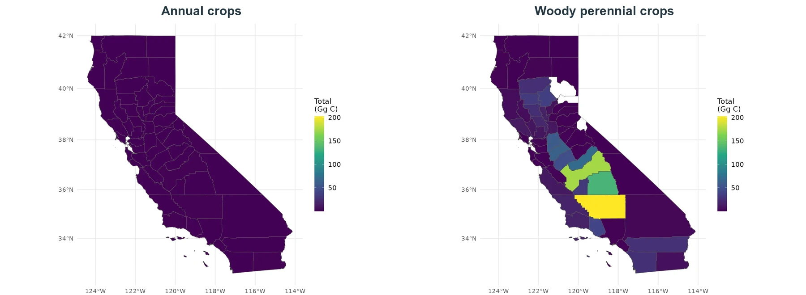
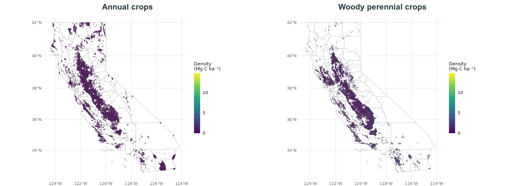
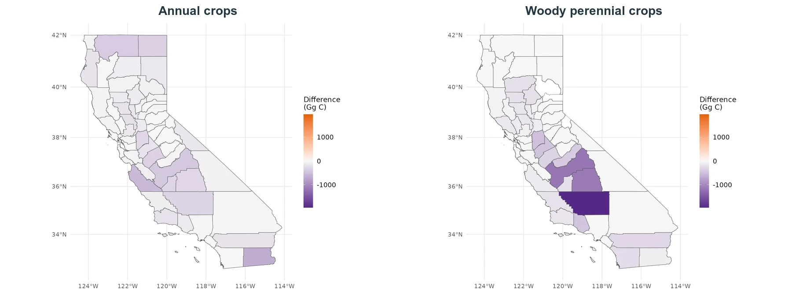

Aboveground biomass is the modeled carbon stock in living plant material above the soil surface. December values are endpoint snapshots rather than annual production totals. Annual-crop biomass is small at the endpoint because harvest removes much of the standing crop; woody perennial crops retain substantially more biomass.

## County aboveground biomass

{#fig-inventory-biomass-county .lightbox fig-alt="Paired California county maps showing December 2023 aboveground-biomass stocks for annual and woody perennial crops"}

Woody perennial biomass is concentrated in the Central Valley and other orchard-producing regions. Annual-crop endpoint totals are much smaller and should be interpreted as standing biomass at the December endpoint, not annual harvested production.

## Field biomass density

{#fig-inventory-biomass-field .lightbox fig-alt="Paired California field maps showing December 2023 aboveground-biomass density for annual and woody perennial crops"}

The field maps separate per-hectare modeled biomass from the amount of agricultural area within a county. Woody perennial fields have higher endpoint densities than annual-crop fields across most represented regions.

## Biomass change, 2016–2023

{#fig-inventory-biomass-change .lightbox fig-alt="Paired California county maps showing aboveground-biomass stock changes between January 2016 and December 2023"}

The historical endpoint comparison is predominantly negative, particularly for woody perennial crops in parts of the Central Valley. These changes describe modeled endpoint stocks and should not be interpreted as harvested yield or cumulative production.
