The Random Forest downscaling model learns relationships between environmental site characteristics and SIPNET model outputs at 100 anchor sites, then predicts to all ~132,000 cropland fields using eight predictors (seven environmental covariates plus field area). The diagnostic plots below reveal **which environmental factors drive the spatial variation** seen in the maps. See the [Scenario Definition Table](atlas_overview.qmd#tbl-scenario-def) for practice parameters and simulation details.

::: {.callout-warning}
## Validation Status

These results are from a proof-of-concept modeling framework that has not been validated against field observations. Interpret all values as illustrative projections, not empirical estimates.
:::

## Model Performance Overview

Before interpreting predictor effects, it is important to understand how well each Random Forest model captures spatial variation. Out-of-bag (OOB) R² measures predictive accuracy on held-out training sites.

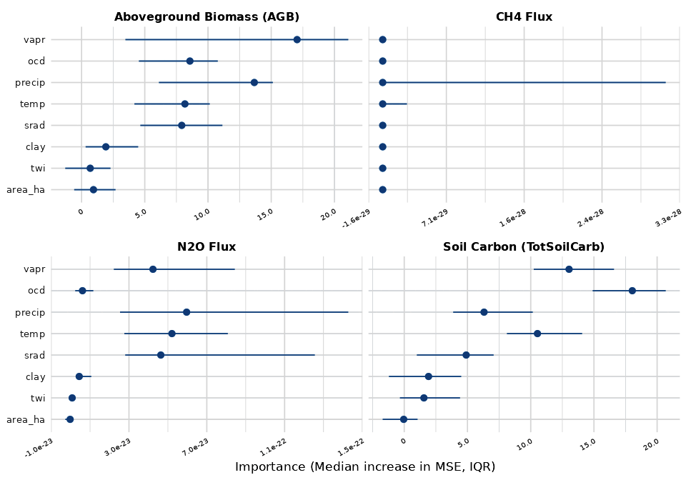{width="100%" fig-alt="Variable importance dotchart for TotSoilCarb, AGB, N2O, and CH4"}

| Variable | Median OOB R² | IQR | Top Predictors | Assessment |
|---|---|---|---|---|
| N~2~O Flux | 0.52 | 0.38–0.72 | vapr, temp | Best spatial model |
| TotSoilCarb | 0.34 | 0.26–0.41 | ocd, vapr | Moderate |
| AGB | 0.09 | -0.04–0.52 | precip, vapr | Poor -- high variance across ensembles |
| CH~4~ Flux | -0.15 | -0.17–-0.13 | *none meaningful* | No spatial signal (near-zero baseline) |

: Downscaling model performance by response variable. R² is the median across 20 ensemble members.

::: {.callout-note}
## Interpreting CH~4~ Model Quality

Non-flooded annual croplands produce near-zero CH~4~ fluxes in SIPNET (approximately 10⁻¹⁴ kg m⁻² at the modeled sites) because methanogenesis requires sustained anaerobic conditions (continuous flooding) that do not occur under standard irrigation. With essentially no spatial variation in the training data, the Random Forest has no signal to learn -- the negative OOB R² (-0.15) confirms the model performs worse than a constant mean. The CH~4~ ALE/ICE plots below reflect noise, not ecology.
:::

## Environmental Predictors

The downscaling model uses eight predictors (seven environmental covariates plus field area):

| Variable | Description | Source | Units | Ecological Role |
|----------|-------------|--------|-------|-----------------|
| `clay` | Clay content | SoilGrids | % | Soil texture controls water holding capacity and physical protection of organic matter |
| `ocd` | Organic carbon density | SoilGrids | hg/m^3^ | Existing soil organic matter -- both a predictor and correlated with the output |
| `twi` | Topographic wetness index | SRTM-derived | - | Topographic position controls water accumulation and drainage |
| `temp` | Mean annual temperature | ERA5 | °C | Temperature drives decomposition rates and plant productivity |
| `precip` | Mean annual precipitation | ERA5 | mm/yr | Moisture availability for plant growth and microbial activity |
| `srad` | Solar radiation | ERA5 | J/m² | Energy input for photosynthesis |
| `vapr` | Vapor pressure | ERA5 | kPa | Atmospheric moisture -- strongly correlated with temperature (r = 0.86) |
| `area_ha` | Field area | CADWR | ha | Structural covariate capturing field-size effects on model predictions |

: Covariates used in the Random Forest downscaling model.

## ALE and ICE Diagnostic Plots

**ALE (Accumulated Local Effects)** plots show the average marginal effect of each predictor on the model output across its range. Steeper slopes indicate stronger influence.

**ICE (Individual Conditional Expectation)** plots show how **each individual anchor site** responds to changes in a predictor while holding all others constant. When ICE lines diverge, it indicates interaction effects -- the predictor's influence depends on other site characteristics.

---

## Total Soil Carbon (TotSoilCarb) {.tabset}

::: {.panel-tabset}

### ALE -- Top Predictors

::: {layout-ncol=2}
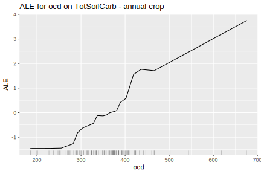{.lightbox group="tsc-ale" fig-alt="ALE plot for top predictor of soil carbon"}

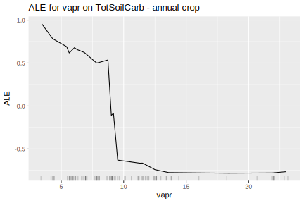{.lightbox group="tsc-ale" fig-alt="ALE plot for second predictor of soil carbon"}
:::

Higher organic carbon density (ocd) --> higher soil carbon: sites with more existing organic matter retain more carbon through the simulation. Vapor pressure (vapr) shows a negative relationship -- higher vapr (warmer, more humid conditions) correlates with lower soil carbon, consistent with faster decomposition at higher temperatures (vapr and temp are highly correlated, r = 0.86).

### ICE -- Top Predictors

::: {layout-ncol=2}
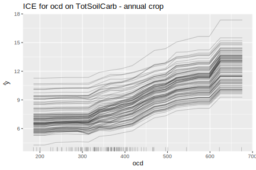{.lightbox group="tsc-ice" fig-alt="ICE plot for top predictor of soil carbon"}

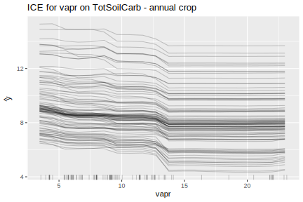{.lightbox group="tsc-ice" fig-alt="ICE plot for second predictor of soil carbon"}
:::

ICE lines that move broadly in parallel indicate the predictor has a **consistent effect** across different site types. Diverging lines would indicate interactions with other environmental gradients.

:::

---

## Aboveground Biomass (AGB) {.tabset}

::: {.panel-tabset}

### ALE -- Top Predictors

::: {layout-ncol=2}
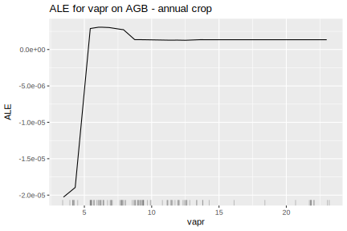{.lightbox group="agb-ale" fig-alt="ALE plot for top predictor of aboveground biomass"}

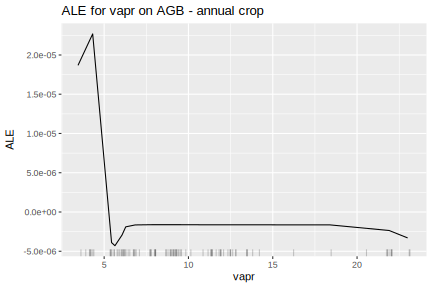{.lightbox group="agb-ale" fig-alt="ALE plot for second predictor of aboveground biomass"}
:::

Precipitation (precip) and vapor pressure (vapr) are the top drivers of AGB variation, though this model has low explanatory power (median OOB R² = 0.09). Higher precipitation --> more water availability --> more growth. Vapor pressure is strongly correlated with temperature (r = 0.86); its negative relationship with AGB likely reflects faster turnover under warmer conditions rather than a direct moisture effect. The wide IQR (-0.04 to 0.52) across ensembles indicates the spatial pattern is not reliable.

### ICE -- Top Predictors

::: {layout-ncol=2}
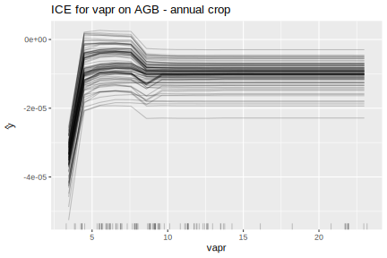{.lightbox group="agb-ice" fig-alt="ICE plot for top predictor of AGB"}

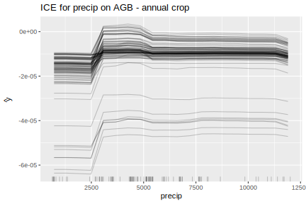{.lightbox group="agb-ice" fig-alt="ICE plot for second predictor of AGB"}
:::

:::

---

## N~2~O Flux {.tabset}

::: {.panel-tabset}

### ALE -- Top Predictors

::: {layout-ncol=2}
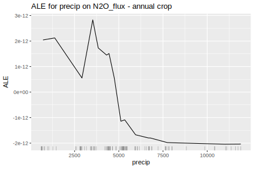{.lightbox group="n2o-ale" fig-alt="ALE plot for top predictor of N2O flux"}

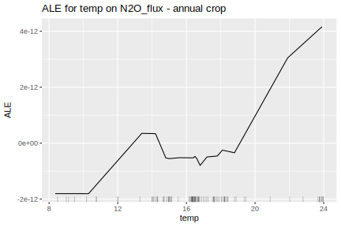{.lightbox group="n2o-ale" fig-alt="ALE plot for second predictor of N2O flux"}
:::

Vapor pressure (vapr) and mean annual temperature (temp) are the top predictors of spatial variation in N~2~O flux (OOB R² = 0.52, our best spatial model). Higher vapr and temperature are associated with greater N~2~O emissions, consistent with warmer conditions promoting nitrification and denitrification. These two predictors are highly correlated (r = 0.86), reflecting California's north-south climate gradient.

### ICE -- Top Predictors

::: {layout-ncol=2}
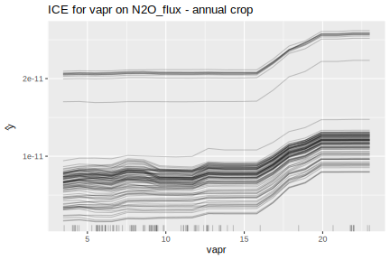{.lightbox group="n2o-ice" fig-alt="ICE plot for top predictor of N2O"}

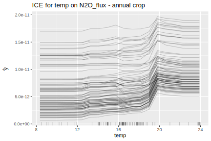{.lightbox group="n2o-ice" fig-alt="ICE plot for second predictor of N2O"}
:::

:::

---

## CH~4~ Flux {.tabset}

::: {.panel-tabset}

### ALE -- Top Predictors

::: {layout-ncol=2}
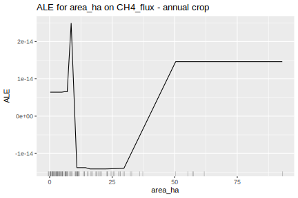{.lightbox group="ch4-ale" fig-alt="ALE plot for top predictor of CH4 flux"}

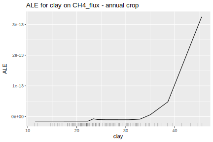{.lightbox group="ch4-ale" fig-alt="ALE plot for second predictor of CH4 flux"}
:::

::: {.callout-warning}
## Low Model Quality

The CH~4~ downscaling model has negative OOB R² (-0.15), indicating it has no predictive skill for spatial variation. Non-flooded annual croplands produce near-zero CH~4~ fluxes (raw SIPNET output on the order of 10⁻¹⁴ kg m⁻²; statewide downscaled total roughly 13,600 kg CH~4~ yr⁻¹) because methanogenesis requires sustained soil saturation that does not occur under standard irrigation, leaving the Random Forest with no spatial signal to learn. The top "predictors" (area_ha, clay) carry no ecological meaning here -- they reflect noise fitting. Interpret these plots accordingly.
:::

### ICE -- Top Predictors

::: {layout-ncol=2}
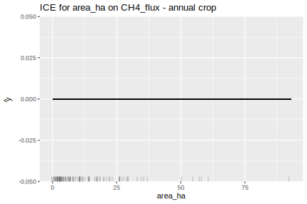{.lightbox group="ch4-ice" fig-alt="ICE plot for top predictor of CH4"}

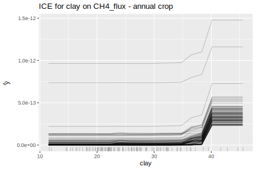{.lightbox group="ch4-ice" fig-alt="ICE plot for second predictor of CH4"}
:::

:::

---

## Why These Drivers Matter

Understanding what drives spatial variation is essential for targeting conservation practices:

1. **If soil type dominates** (clay, ocd) -- practice benefits are site-specific, and adoption should prioritize fields with responsive soil types.
2. **If climate dominates** (temp, vapr, precip) -- practice effects vary with regional climate, suggesting geographic targeting based on climate zones.
3. **If the practice effect is uniform** regardless of drivers -- broad-scale adoption is efficient because benefits are not geographically restricted.

The field-level difference maps in the [Soil Carbon Atlas](atlas_soil_carbon.qmd) and [GHG Emissions Atlas](atlas_ghg_emissions.qmd) show which pattern applies for each variable and scenario.
