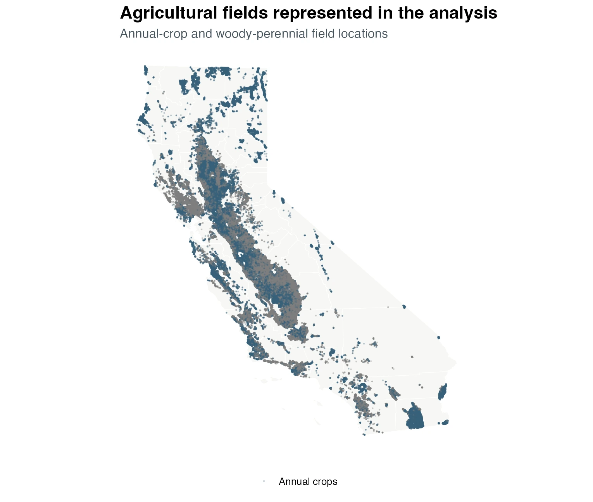

This atlas presents two related sets of model results for California agriculture: a historical inventory for 2016–2023 and four future configurations for 2024–2045. The inventory describes modeled conditions under recorded historical inputs. The future configurations compare management, climate-model, and emissions-pathway assumptions.

{#fig-inventory-context .lightbox fig-alt="Map of California showing annual-crop and woody-perennial field locations represented in the downscaling analysis"}

Results summarize the agricultural fields represented in the downscaling dataset; they are not totals for all California land. County maps show modeled totals over represented fields, while field maps show area-normalized values.

## Historical inventory

The historical inventory covers January 2016 through December 2023. It reports soil-carbon and aboveground-biomass stocks, together with annualized endpoint rates for nitrous oxide and methane. Stock changes compare the January 2016 and December 2023 monthly means. Gas endpoint rates should not be interpreted as emissions integrated across the full inventory period.

The inventory pages separate annual crops and woody perennial crops because their carbon stocks, biomass, and spatial distributions differ substantially:

- [Soil Carbon](atlas_soil_carbon.qmd) shows county stocks, field densities, and 2016–2023 stock changes.
- [GHG Emissions](atlas_ghg_emissions.qmd) shows the strongest supported nitrous-oxide patterns and explains the current gas-reporting boundary.
- [Aboveground Biomass](atlas_biomass.qmd) shows endpoint stocks, field densities, and historical changes.
- [Downscaling Results](downscaling_results.qmd) provides concise inventory and scenario summaries.

## Future configurations

The future analysis holds three dimensions separate: management, climate model, and emissions pathway. The reference configuration uses business-as-usual management, CESM2 climate, and SSP370. Each alternative changes one dimension relative to that reference.

| Configuration | Management | Climate model | Pathway | Comparison with reference |
|---|---|---|---|---|
| Reference | BAU | CESM2 | SSP370 | Reference |
| Management | NBS | CESM2 | SSP370 | Management change |
| Climate model | BAU | MPI-ESM1-2-HR | SSP370 | Climate-model sensitivity |
| Pathway | BAU | CESM2 | SSP585 | Emissions-pathway sensitivity |

: Four future configurations used for the 2024–2045 analysis. {#tbl-scenario-def}

The [Future Management and Climate Scenarios](scenarios.qmd) page presents statewide soil-carbon responses, county contrasts against the reference, and annual model-defined N~2~O-N for the reference and management configurations.

## Interpretation

These are model-derived results. The model has been minimally tested against site level observations and syntheses of available research.

Ensemble ranges describe variation among parameter ensemble members; they are not observational confidence intervals. Scenario contrasts retain original member identity before summarization. Soil-carbon stocks and changes are reported separately from gas fluxes, and native carbon or nitrogen units are retained where complete CO~2~-equivalent accounting is not available.
