Soil carbon is the primary metric for climate change mitigation in agriculture. Higher soil carbon stocks indicate more atmospheric CO~2~ sequestered into persistent soil organic matter pools. See the [Scenario Definition Table](atlas_overview.qmd#tbl-scenario-def) for practice parameters and simulation details.

::: {.callout-warning}
## Validation Status

These results are from a proof-of-concept modeling framework that has not been validated against field observations. Interpret all values as illustrative projections, not empirical estimates.
:::

## County-Level Total Soil Carbon

County maps show the **total mass** of soil carbon (Gg C) summed across all annual cropland fields in each county. Central Valley counties (Kern, Fresno, Tulare, San Joaquin) dominate because they contain the most cropland area -- not necessarily because of higher per-hectare soil carbon.

### Combined View: Baseline + Scenario Differences

The most powerful comparison view. The first panel shows **absolute baseline** soil carbon stocks. Panels 2--6 show each scenario's **difference from baseline** (positive values indicate increases, negative values indicate decreases).

{.lightbox group="mixed" fig-alt="Combined view showing baseline soil carbon alongside scenario differences for each county"}

::: {.callout-note}
## Interpretation

All management scenarios increase county-level soil carbon relative to baseline. Compost (+12.2%) and stacked (+16.6%) show the strongest gains. Tillage reductions produce small but positive effects: reduced till (+0.2%) and zero till (+0.4%). Drip irrigation (+3.3%) provides moderate gains. The largest absolute increases occur in high-acreage Central Valley counties (Kern, Fresno, Tulare) where even modest per-hectare increases translate to large county totals.
:::

### All Scenarios Side-by-Side

All six scenarios on a consistent color scale for direct visual comparison.

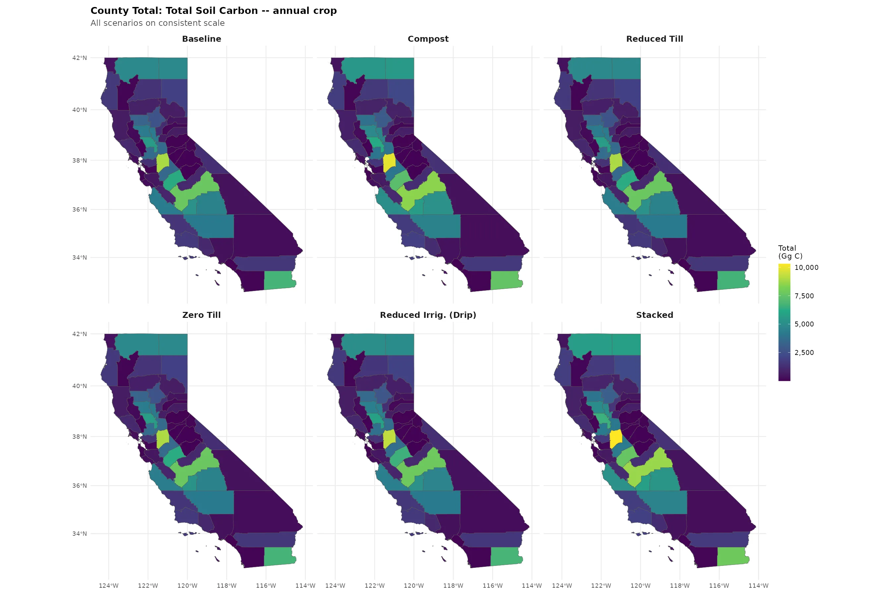{.lightbox group="county-facet" fig-alt="Faceted map showing county-level total soil carbon for all six management scenarios on a consistent scale"}

### Individual Scenario Maps {.tabset}

::: {.panel-tabset}

#### Baseline

{.lightbox group="county-stock" fig-alt="Baseline county total soil carbon map"}

Baseline agricultural practices. This is the reference against which all management scenarios are compared.

#### Compost

{.lightbox group="county-stock" fig-alt="Compost scenario county total soil carbon map"}

Compost application directly adds organic carbon to soil. Expected to show the strongest per-practice effect on soil carbon because it physically increases C inputs beyond what crops alone provide.

#### Reduced Till

{.lightbox group="county-stock" fig-alt="Reduced till county total soil carbon map"}

Reduced tillage preserves soil aggregates, slowing decomposition of protected organic matter. The effect is through reduced C loss rather than increased C inputs.

#### Zero Till

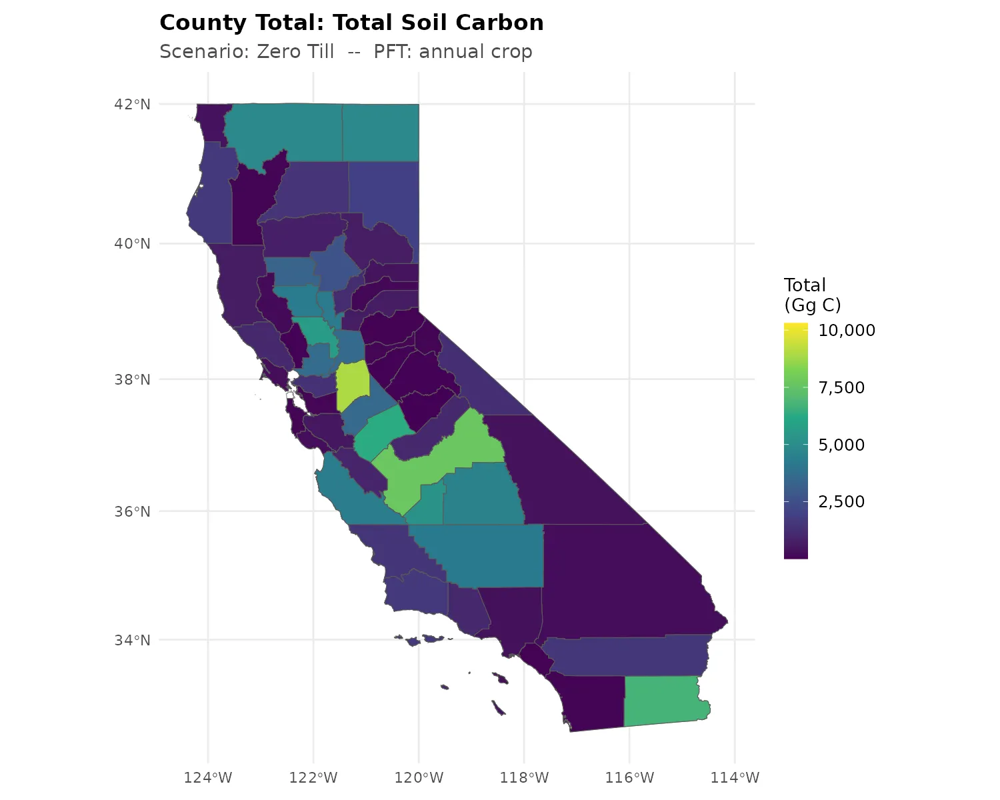{.lightbox group="county-stock" fig-alt="Zero till county total soil carbon map"}

No mechanical soil disturbance. Surface residue builds a mulch layer over time. Soil carbon effects in the literature are debated -- some studies show vertical redistribution rather than net gain.

#### Drip Irrigation

{.lightbox group="county-stock" fig-alt="Drip irrigation county total soil carbon map"}

Conversion from flood/sprinkler to drip irrigation. Soil carbon gain likely mediated through altered moisture regimes affecting decomposition rates and root growth.

#### Stacked

{.lightbox group="county-stock" fig-alt="Stacked scenario county total soil carbon map"}

All practices combined. Represents maximum adoption.

:::

---

## County-Level Difference Maps (Scenario - Baseline)

These maps directly answer: **"Does this practice increase or decrease soil carbon compared to current management?"**

Positive differences indicate increases in soil carbon (climate benefit); negative differences indicate decreases.

### All Scenarios Compared

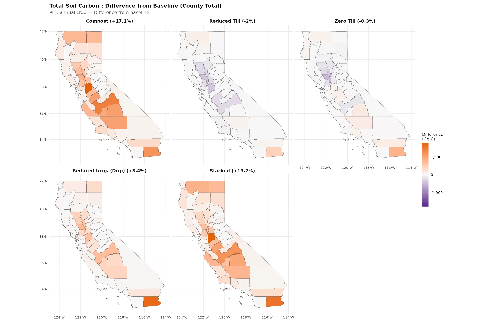{.lightbox group="county-diff-facet" fig-alt="Faceted difference maps showing soil carbon changes from baseline for five management scenarios"}

::: {.callout-note}
## Interpretation

All scenarios show soil carbon gains relative to baseline. Compost (+12.2%), drip irrigation (+3.3%), and stacked (+16.6%) show the clearest gains. Reduced tillage (+0.2%) and zero tillage (+0.4%) show small positive effects consistent with reduced soil disturbance preserving organic matter. The spatial pattern of gains broadly follows cropland area -- the largest absolute gains occur where there is the most cropland to respond.
:::

### Individual Difference Maps {.tabset}

::: {.panel-tabset}

#### Compost

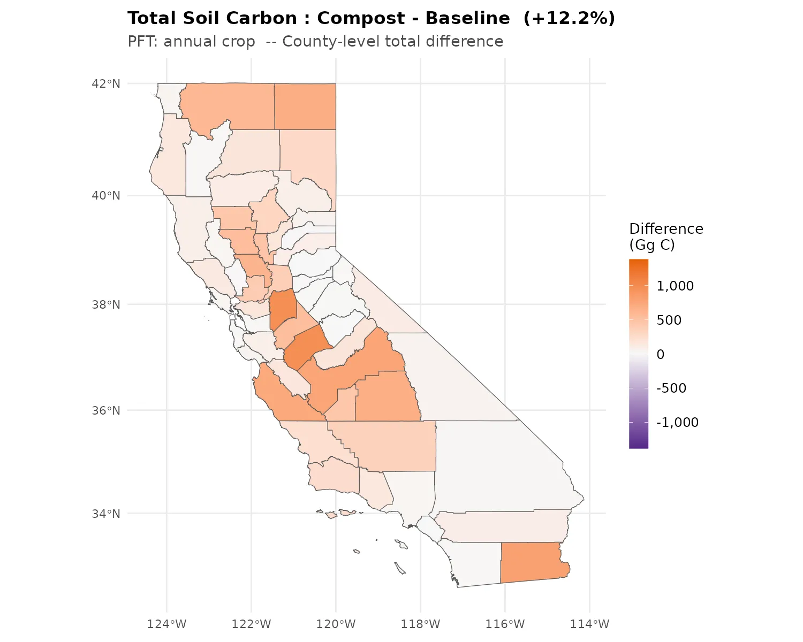{.lightbox group="county-diff" fig-alt="Compost minus baseline soil carbon difference map"}

Compost increases soil carbon substantially across the Central Valley. The effect is driven by direct organic matter addition. Statewide total increases from 112.3 to 125.9 Tg C (+12.2%). This magnitude is broadly consistent with field studies of compost application in California: Ryals and Silver (2013, Ecological Applications) reported SOC increases of approximately 0.5--1.0 Mg C ha⁻¹ in the top 10 cm over 3 years following a single compost application to California grasslands. Our modeled gains reflect repeated annual application over 8 years to croplands, so a larger cumulative effect is expected.

#### Reduced Till

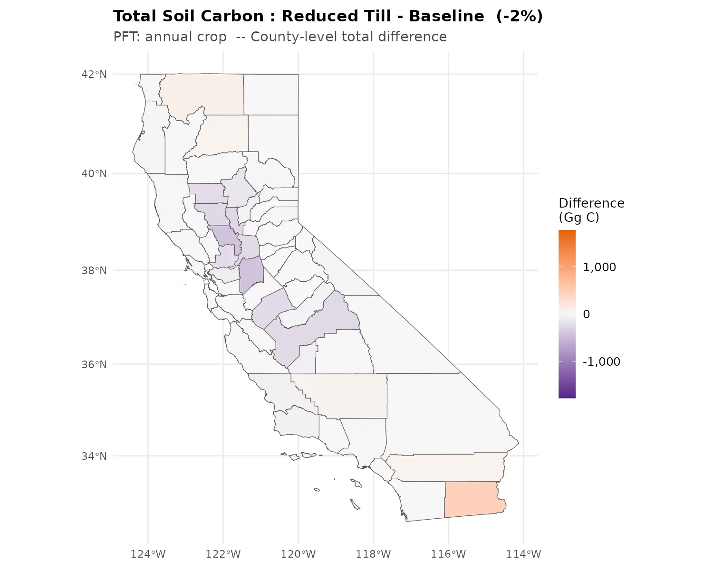{.lightbox group="county-diff" fig-alt="Reduced till minus baseline soil carbon difference map"}

Small positive gain in soil carbon (+0.2% statewide, +0.14 Mg C ha⁻¹). Reduced tillage preserves soil aggregates and slows decomposition of physically protected organic matter. The modest magnitude over 8 years is consistent with the Six et al. (2004, Oecologia) meta-analysis, which found that no-till SOC benefits are small in the first decade, particularly in dry climates, and become more pronounced after 10+ years as soils approach a new equilibrium.

#### Zero Till

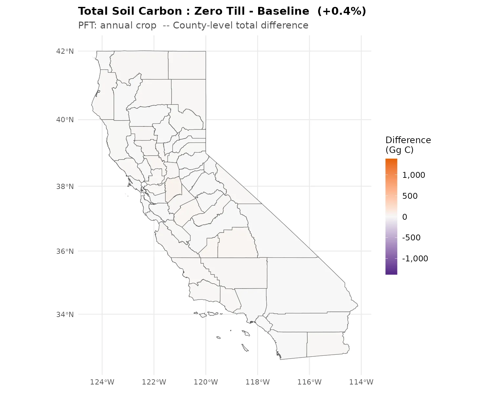{.lightbox group="county-diff" fig-alt="Zero till minus baseline soil carbon difference map"}

Small positive gain in soil carbon (+0.4% statewide, +0.25 Mg C ha⁻¹). Zero till eliminates mechanical soil disturbance entirely, preserving aggregate structure and surface residue. The gain is slightly larger than reduced till, consistent with the greater degree of soil disturbance reduction. The magnitude is at the lower end of literature values for the first decade of adoption (Six et al. 2004, Oecologia), which is expected given that SOC accumulation under no-till is a slow process that accelerates after initial soil structure recovery.

#### Drip Irrigation

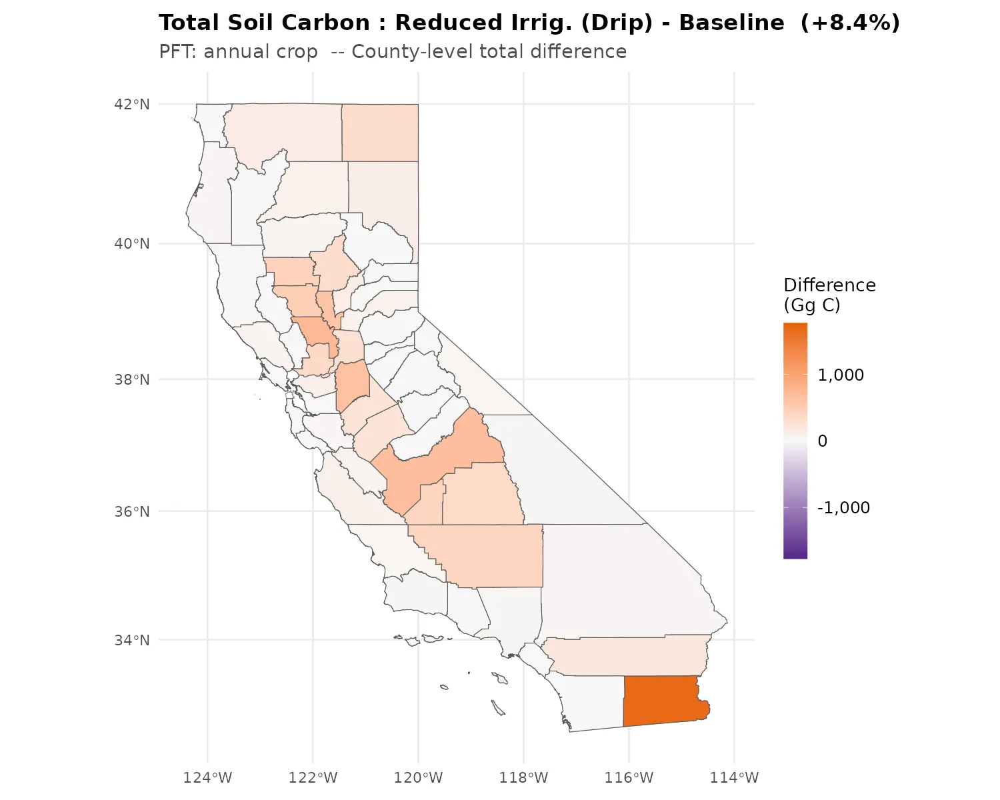{.lightbox group="county-diff" fig-alt="Drip irrigation minus baseline soil carbon difference map"}

Moderate gains (+3.3% statewide). Conversion from flood/sprinkler to drip irrigation alters soil moisture dynamics, potentially reducing decomposition rates in the upper soil profile by maintaining lower and more consistent soil moisture.

#### Stacked

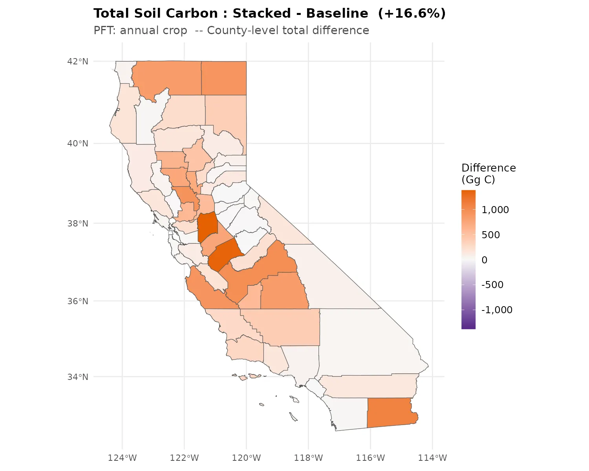{.lightbox group="county-diff" fig-alt="Stacked minus baseline soil carbon difference map"}

Strongest combined gain (+16.6%), exceeding compost alone, with consistent increases across all counties. The stacked scenario combines compost's direct C input with tillage reduction and drip irrigation's moisture regulation. The super-additive effect (+16.6% vs. compost's +12.2%) suggests practice interactions where reduced tillage and altered moisture regimes enhance the retention of compost-derived organic matter.

:::

---

## Field-Level Soil Carbon Density

Field density maps show **per-hectare** soil carbon (Mg C ha⁻¹) at each of ~132,000 individual agricultural fields. This isolates the per-area effect from county cropland area, revealing how **soil type, climate, and topography** drive spatial variation.

### All Scenarios Side-by-Side

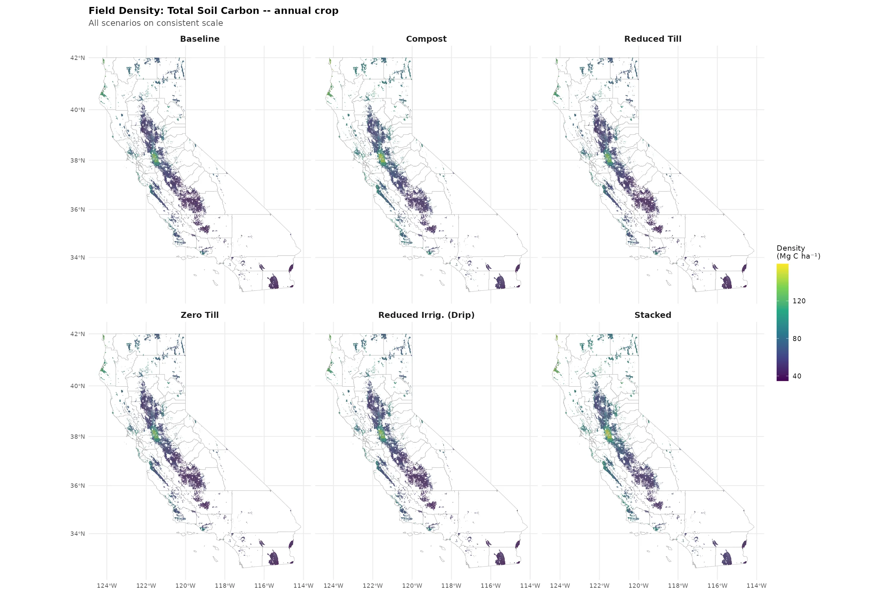{.lightbox group="field-facet" fig-alt="Faceted map showing field-level soil carbon density for all six scenarios"}

### Individual Scenario Maps {.tabset}

::: {.panel-tabset}

#### Baseline

{.lightbox group="field-density" fig-alt="Baseline field-level soil carbon density map"}

Spatial variation reflects underlying environmental gradients: soil clay content, organic carbon density, temperature, and moisture. Sacramento Valley (north) tends to show higher per-hectare SOC than San Joaquin Valley (south), consistent with cooler temperatures slowing decomposition.

#### Compost

{.lightbox group="field-density" fig-alt="Compost field-level soil carbon density map"}

#### Reduced Till

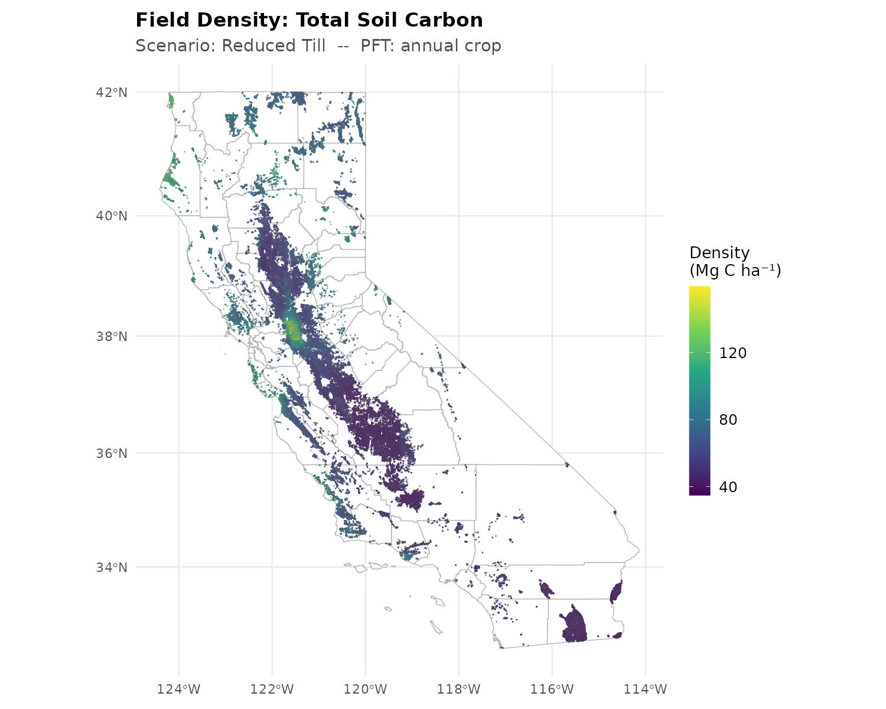{.lightbox group="field-density" fig-alt="Reduced till field-level soil carbon density map"}

#### Zero Till

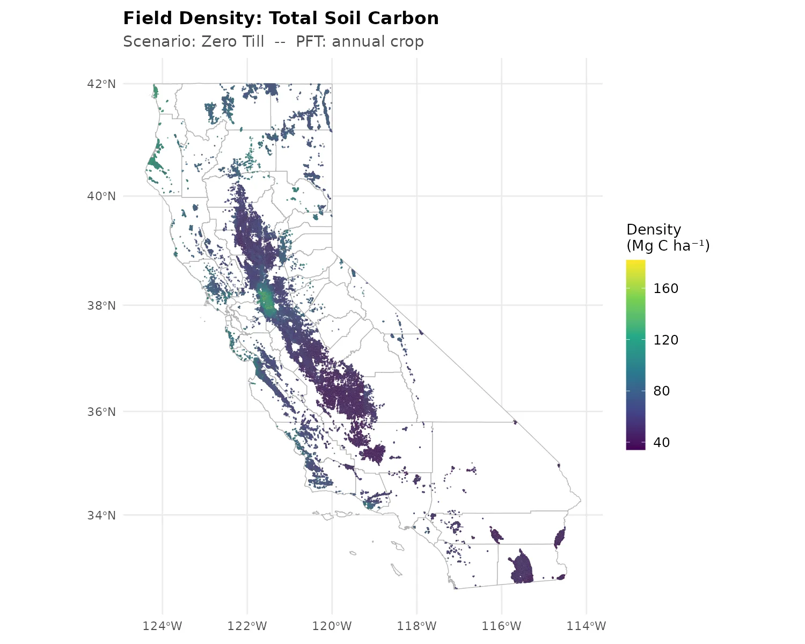{.lightbox group="field-density" fig-alt="Zero till field-level soil carbon density map"}

#### Drip Irrigation

{.lightbox group="field-density" fig-alt="Drip irrigation field-level soil carbon density map"}

#### Stacked

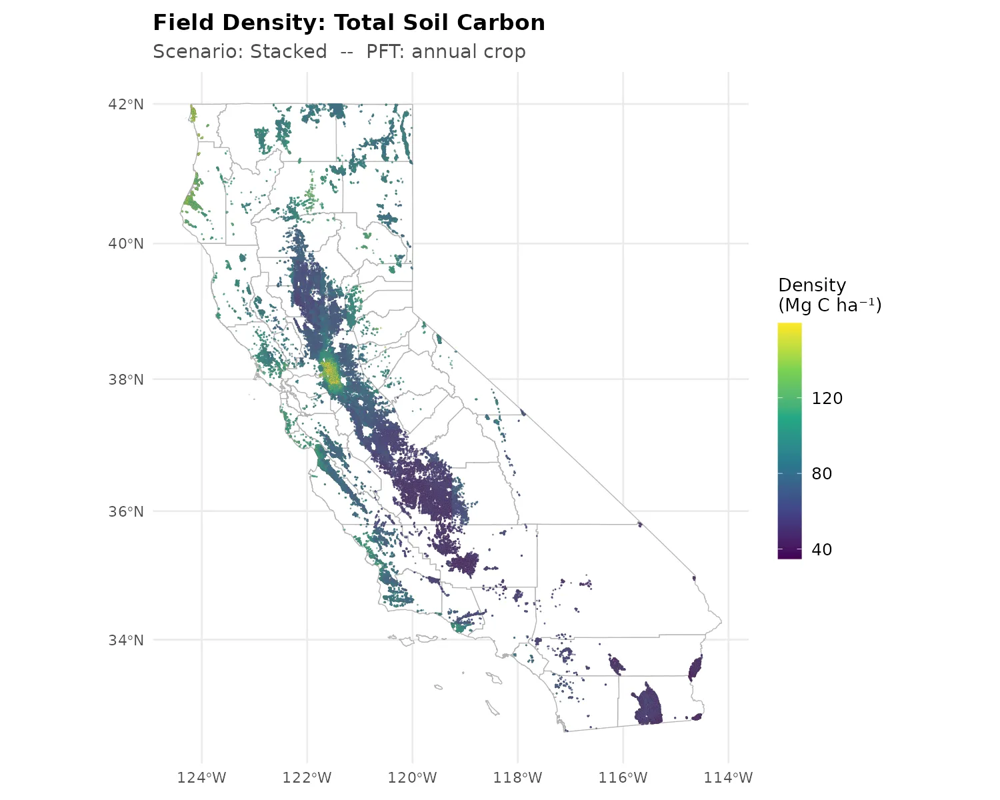{.lightbox group="field-density" fig-alt="Stacked field-level soil carbon density map"}

:::

---

## Field-Level Soil Carbon Differences

Field-level difference maps reveal **where** practices have the greatest per-hectare impact, independent of county cropland area. These are the most spatially informative maps in the atlas.

### All Scenarios Compared

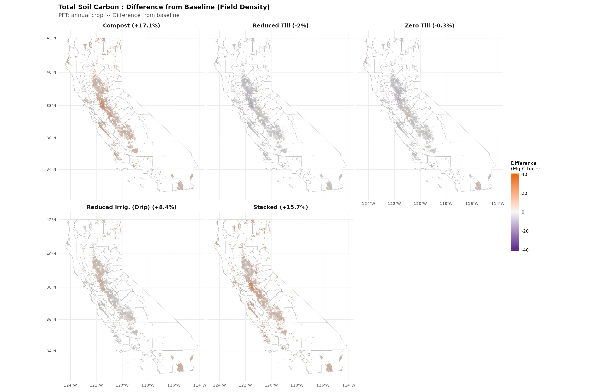{.lightbox group="field-diff-facet" fig-alt="Faceted field-level difference maps for soil carbon density across management scenarios"}

::: {.callout-note}
## Interpretation

Compost and stacked scenarios show relatively uniform increases across nearly all fields, indicating the practice effect is **geographically consistent** -- compost increases soil carbon regardless of local soil or climate conditions. Tillage scenarios (reduced till, zero till) show small but uniformly positive differences, confirming that the SOC benefit of reduced soil disturbance, while modest, is not restricted to specific regions or soil types.
:::

### Individual Difference Maps {.tabset}

::: {.panel-tabset}

#### Compost

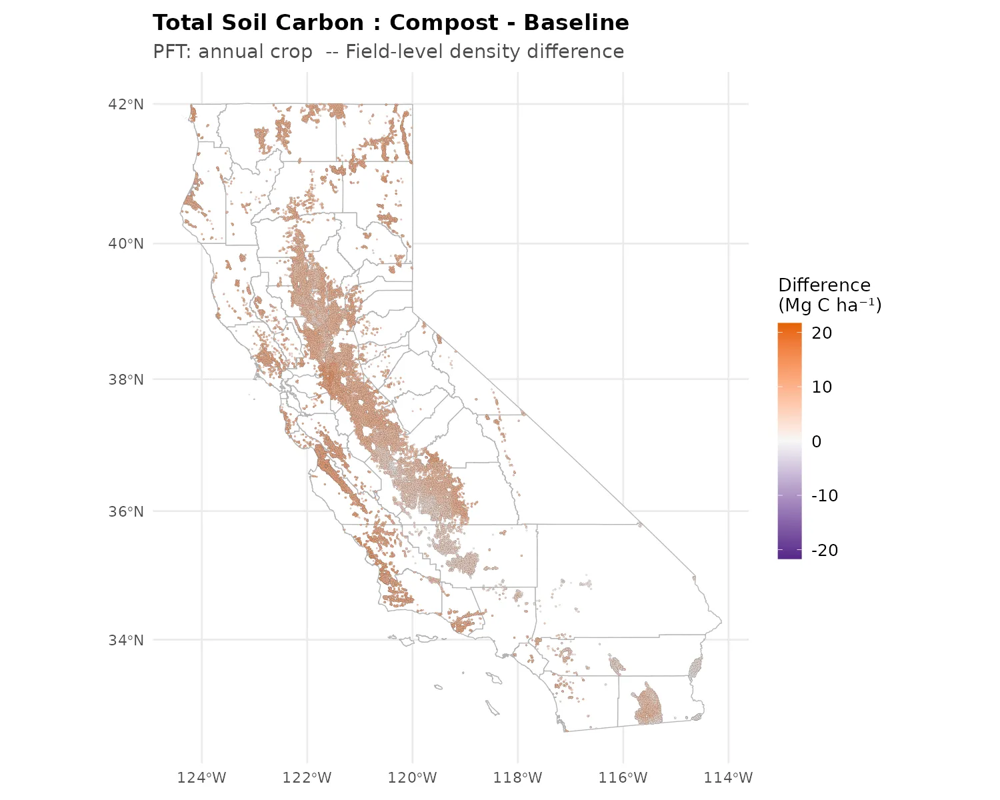{.lightbox group="field-diff" fig-alt="Field-level difference in soil carbon density for compost vs baseline"}

Near-uniform increases across all fields. The compost effect on soil carbon is driven primarily by the practice itself (direct organic matter input) rather than by site-specific soil or climate conditions.

#### Reduced Till

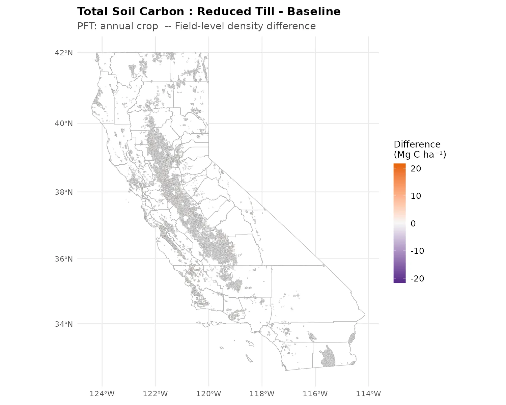{.lightbox group="field-diff" fig-alt="Field-level difference in soil carbon density for reduced till vs baseline"}

#### Zero Till

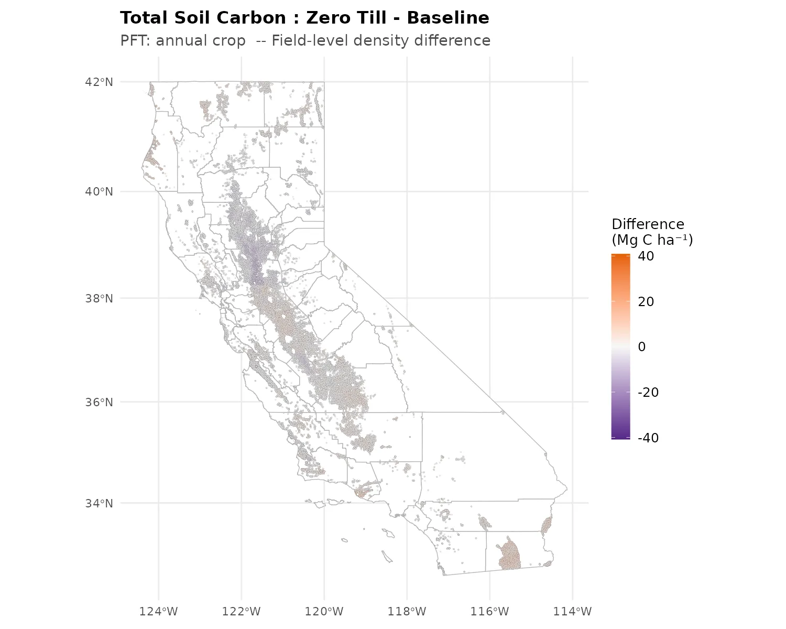{.lightbox group="field-diff" fig-alt="Field-level difference in soil carbon density for zero till vs baseline"}

#### Drip Irrigation

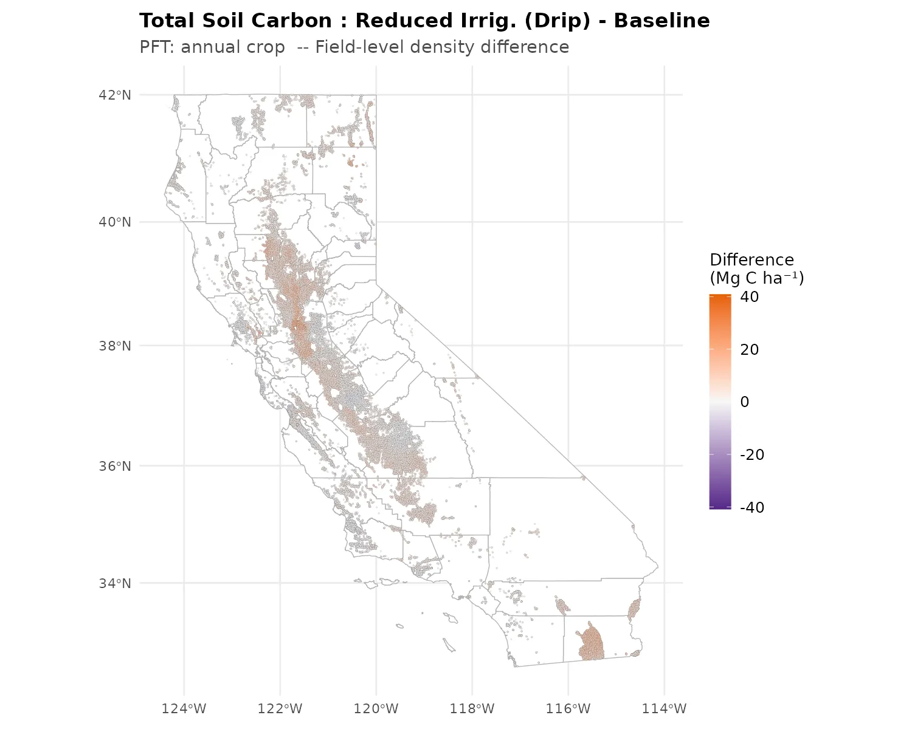{.lightbox group="field-diff" fig-alt="Field-level difference in soil carbon density for drip irrigation vs baseline"}

#### Stacked

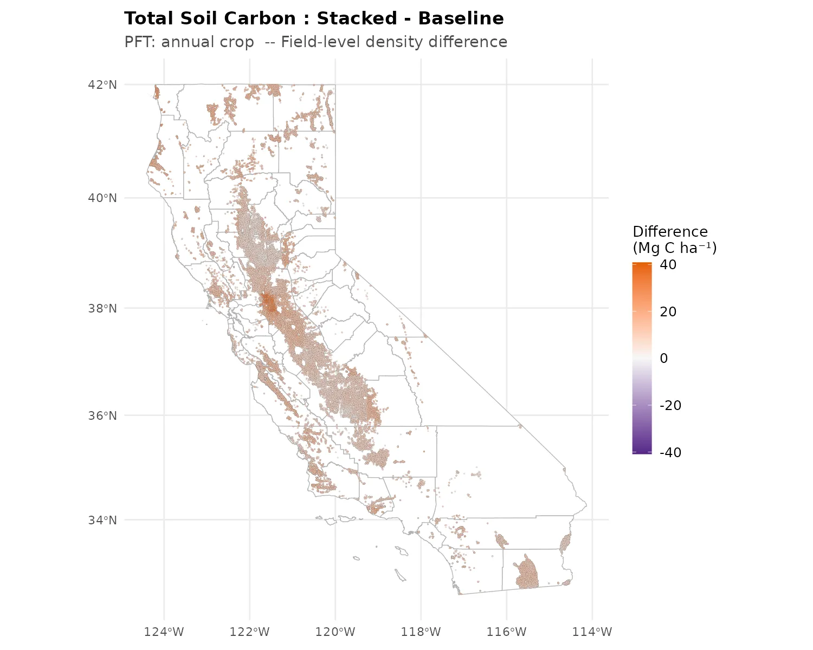{.lightbox group="field-diff" fig-alt="Field-level difference in soil carbon density for stacked vs baseline"}

Largest per-hectare gains. The uniform spatial pattern indicates the combined practices work consistently across California's diverse agricultural environments.

:::
