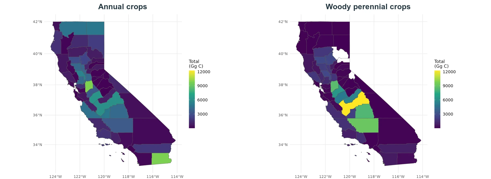
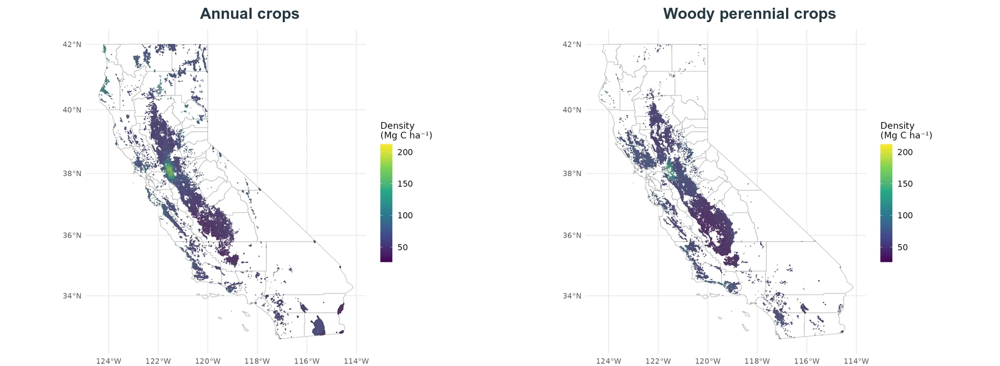
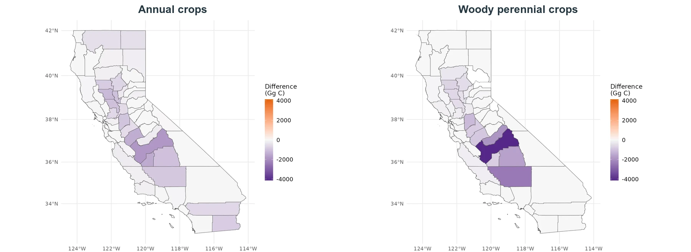

Soil carbon is reported as a stock. County maps sum modeled stocks across represented fields; field maps report carbon density per hectare. Historical changes compare January 2016 and December 2023 monthly means.

## County soil-carbon stocks

{#fig-inventory-soc-county .lightbox fig-alt="Paired California county maps showing December 2023 soil-carbon stocks for annual and woody perennial crops"}

The largest county totals occur where substantial represented agricultural area coincides with moderate or high modeled stock density. The annual and woody maps use the same units but should be interpreted separately because the crop classes occupy different fields.

## Field soil-carbon density

{#fig-inventory-soc-field .lightbox fig-alt="Paired California field maps showing December 2023 soil-carbon density for annual and woody perennial crops"}

Field density reveals spatial variation that is obscured by county totals. Northern and coastal agricultural regions generally show higher modeled density than many southern and interior fields, although variation occurs within each crop class.

## Soil-carbon change, 2016–2023

{#fig-inventory-soc-change .lightbox fig-alt="Paired California county maps showing soil-carbon stock changes between January 2016 and December 2023"}

Modeled soil-carbon stocks decline across much of the represented area over the historical period. The largest negative county changes occur in agricultural regions with substantial represented area. These values are endpoint stock differences in Gg C, not annualized rates or atmospheric removals.

For the future comparison, see [Future Management and Climate Scenarios](scenarios.qmd).
