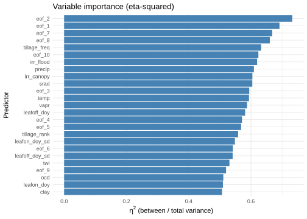
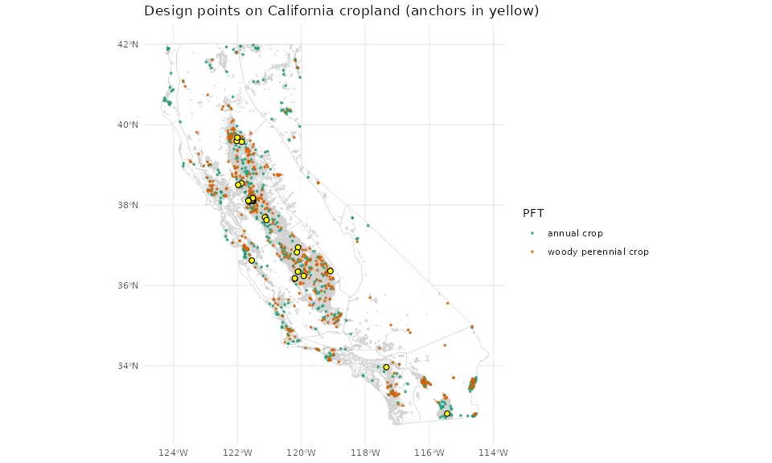
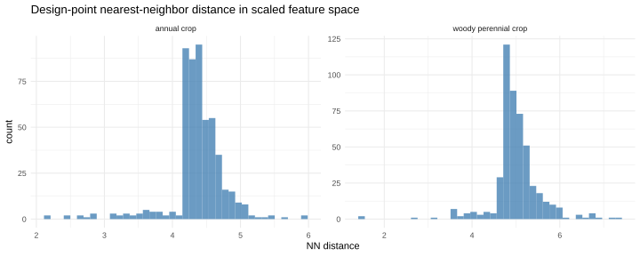
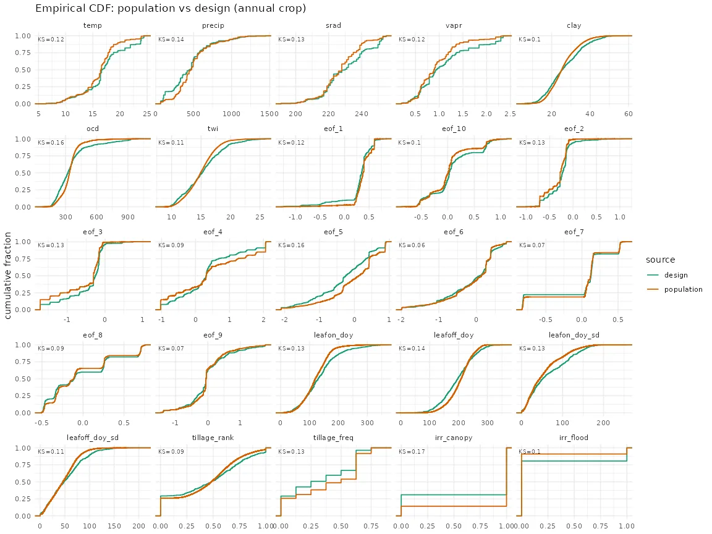
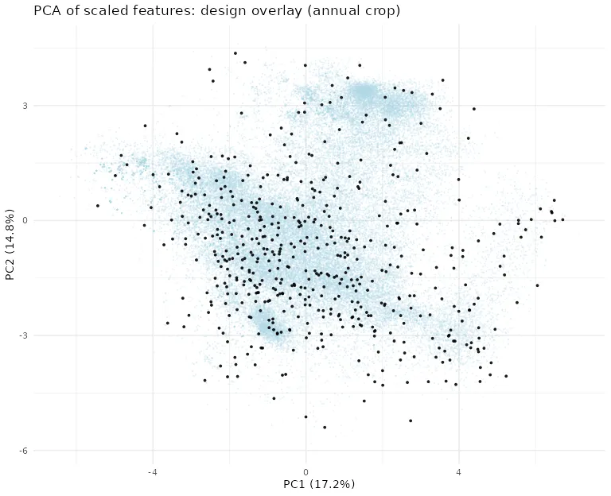
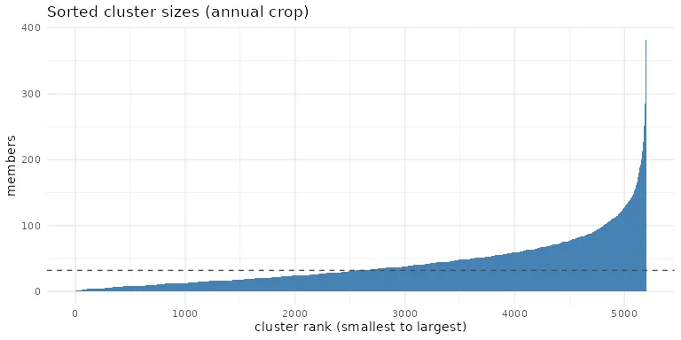
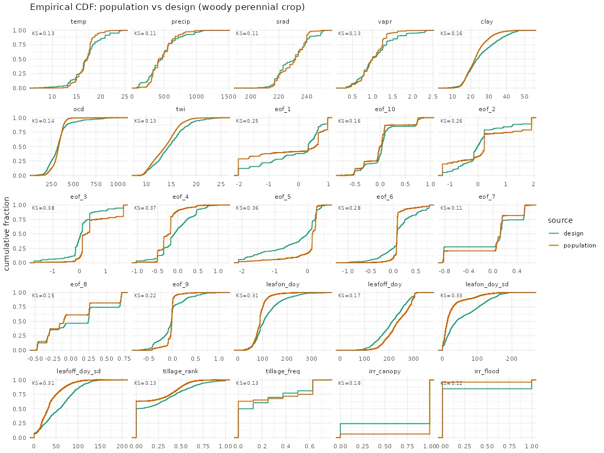
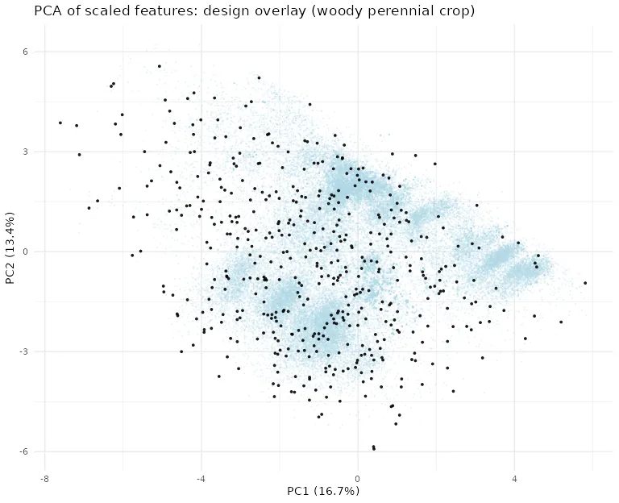
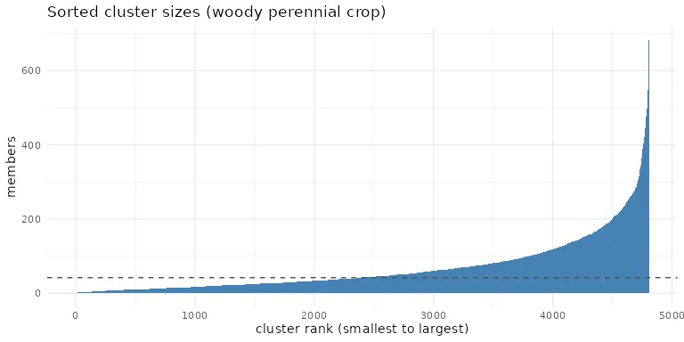

This report validates feature-space coverage of the selected design points relative to the statewide population. It does not determine the optimal number of SIPNET design points. The 1,000-site design evaluated here is selected from the 10,000-site candidate pool for demonstration.
<!-- TODO update after the optimal number of design points is determined by github.com/ccmmf/organization#192 -->

```{r setup}
library(knitr)
val <- function(name) {
  readr::read_csv(
    here::here("reports", paste0("design_point_validation_", name, ".csv")),
    show_col_types = FALSE
  )
}
```

## Overview

Design points are the field locations where SIPNET is run; a Random Forest then downscales those outputs to every cropland field in the CADWR LandIQ Crop Map. `020_cluster_sites.R` clusters the population per plant functional type and keeps one representative per cluster as a 10,000-site candidate pool, `021_subsample_design_points.R` draws the design from that pool by farthest point sampling, and `022_validate_design_points.R` writes the tables and figures below. Coverage matters because the Random Forest predicts reliably only within the range of conditions the design spans, so gaps in covariate coverage become extrapolation.

Clustering uses seed 42 (`020_cluster_sites.R`).

## PFT allocation

Population and design counts and area share per PFT.

```{r}
kable(val("pft_allocation"))
```

## Feature space coverage (MSSD, scaled)

Mean squared shortest distance from each population field to its nearest design point in scaled feature space. Lower is better coverage.

```{r}
kable(val("mssd"), digits = 4)
```

## Cluster balance (Gini of cluster sizes)

```{r}
kable(val("cluster_balance"), digits = 3)
```

## Anchor recovery

```{r}
kable(val("anchor_recovery"))
```

```{r}
#| output: asis
mon <- here::here("reports", "design_point_validation_monitoring_coverage.csv")
if (file.exists(mon)) {
  cat("## Monitoring layer coverage\n\nShare of the population and of the design carrying each management and phenology feature.\n\n")
  print(kable(readr::read_csv(mon, show_col_types = FALSE)))
}
```

```{r}
#| output: asis
reg <- here::here("reports", "design_point_validation_climate_region_coverage.csv")
if (file.exists(reg)) {
  cat("## Climate region coverage\n\n")
  print(kable(readr::read_csv(reg, show_col_types = FALSE)))
}
```

## Figures

<!-- two PFTs (annual crop, woody perennial crop); add figure blocks if a third PFT is introduced -->


















