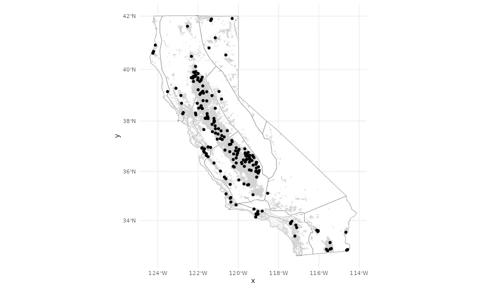
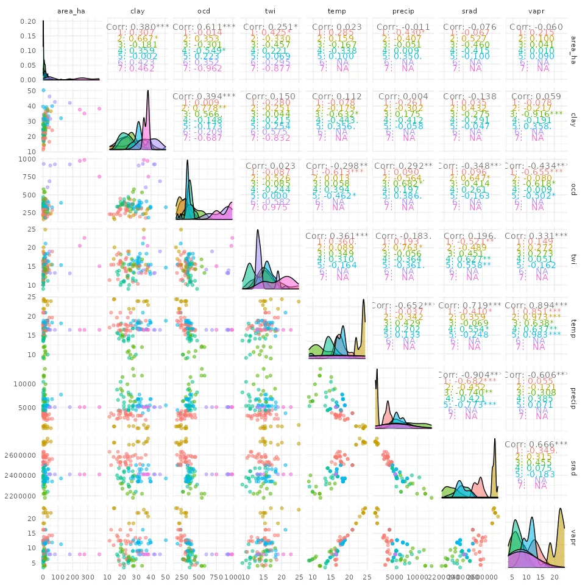
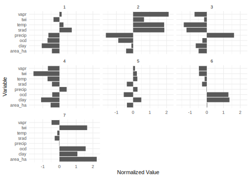

```{r setup, include=FALSE}
options(ccmmf.quiet_banner = TRUE)
```

## Overview

Design points are representative field locations selected to capture the range of environmental conditions across California croplands from the CADWR statewide crop mapping dataset. These are the locations where the SIPNET ecosystem model is run; its outputs are then downscaled via Random Forest to all cropland fields. A total of 198 design points were selected: 100 for annual crops and 98 for woody perennial crops. The current atlas uses the 100 annual crop sites. See the [Scenario Definition Table](atlas_overview.qmd#tbl-scenario-def) for practice parameters and simulation details.

::: {.callout-warning}
## Validation Status

These results are from a proof-of-concept modeling framework that has not been validated against field observations. Interpret all values as illustrative projections, not empirical estimates.
:::

## Selection Method

Design points were selected using hierarchical k-means clustering (`factoextra::hkmeans`) on eight covariates (seven environmental variables plus field area) extracted at each CADWR cropland field centroid. The algorithm first performs agglomerative hierarchical clustering to generate initial cluster assignments, then refines them with k-means. The optimal number of clusters was determined using elbow and silhouette criteria. Design points were then randomly sampled from the clustered fields, so each design point corresponds to a real field with measured covariates.

The environmental covariates used for clustering are:

| Variable | Description                 | Source        | Units     | Ecological Role |
|----------|-----------------------------|---------------|-----------|-----------------|
| temp     | Mean annual temperature     | ERA5          | °C        | Decomposition rates, plant productivity |
| precip   | Mean annual precipitation   | ERA5          | mm/yr     | Moisture availability for growth |
| srad     | Solar radiation             | ERA5          | J/m²      | Photosynthetic energy input |
| vapr     | Vapor pressure              | ERA5          | kPa       | Atmospheric moisture, strongly correlated with temperature |
| clay     | Clay content                | SoilGrids     | %         | Water holding capacity, C protection |
| ocd      | Organic carbon density      | SoilGrids     | hg/m^3^   | Existing soil organic matter |
| twi      | Topographic wetness index   | SRTM-derived  | unitless  | Water accumulation, drainage |

: Environmental covariates used for design point selection.

## Map of Selected Design Points

The map below shows all 198 design points (both annual and woody perennial crop types) overlaid on the CADWR cropland field polygons (grey). Boundary lines are California climate zones from CalAdapt.

{.lightbox group="design" fig-alt="Map of California showing 198 design points distributed across croplands in the Central Valley, Sacramento Valley, coastal areas, and Imperial Valley"}

The design points are well distributed across California's major agricultural regions:

- **Central Valley** (Sacramento and San Joaquin valleys) -- densest coverage, matching the concentration of cropland
- **Imperial Valley** (southeast) -- represented despite being geographically isolated from the main Central Valley
- **Coastal valleys** (Salinas, Oxnard, Santa Maria) -- covered, capturing the cooler coastal climate
- **Northern California** (Shasta, Modoc) -- sparse but present, representing the cooler and drier northeastern croplands

This geographic coverage is important because the Random Forest downscaling model can only predict reliably within the range of environmental conditions represented by the training sites. Gaps in design point coverage would create extrapolation zones where predictions are less reliable.

## Relationships Among Environmental Covariates

The pairs plot below shows bivariate relationships between all seven covariates, with colors indicating cluster membership. Diagonal panels show the distribution of each covariate within each cluster.

{.lightbox group="design" fig-alt="Pairs plot matrix showing relationships between 7 environmental covariates at design points colored by cluster"}

Key patterns visible in the pairs plot:

- **temp vs vapr**: Strong positive correlation (r = 0.86). Both track California's north-south temperature gradient. This collinearity means the downscaling model cannot fully separate temperature effects from vapor pressure effects.
- **precip vs srad**: Strong negative correlation (r = -0.86). Wetter areas receive less solar radiation, reflecting the coastal vs inland climate divide.
- **ocd vs vapr**: Moderate negative correlation (r = -0.55). Warmer areas tend to have lower soil organic carbon, consistent with faster decomposition under higher temperatures.
- **Cluster separation**: Clusters are visually distinct in several covariate pairs (e.g., temp-precip, vapr-ocd), indicating the clustering captured meaningful environmental gradients rather than arbitrary groupings.

For quantitative collinearity analysis, see the [Model Evaluation](variable_importance.qmd) page.

## Environmental Characteristics of Each Cluster

The radar plots below show the normalized mean values of environmental covariates for each cluster. Each spoke represents one covariate, scaled to [0, 1] across all design points. The shape of each cluster's profile reveals its environmental signature.

{.lightbox group="design" fig-alt="Radar or bar plot showing normalized environmental covariate values for each cluster"}

Clusters with distinct profiles confirm that the clustering algorithm captured real environmental gradients in California's agricultural landscape -- for example, separating hot/dry southern Central Valley sites from cool/wet northern Sacramento Valley sites. This diversity in training conditions is what allows the Random Forest to learn how SIPNET outputs vary across environmental gradients and then predict to unseen fields.
