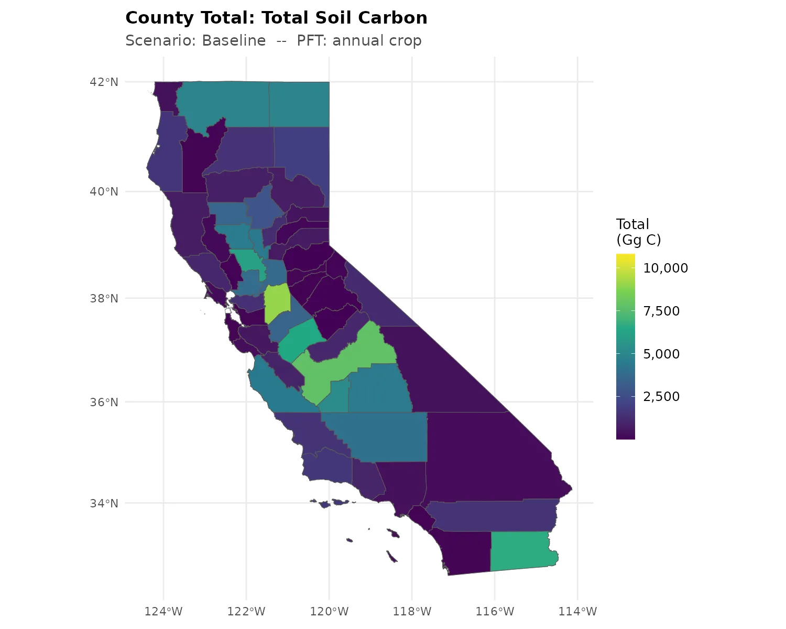
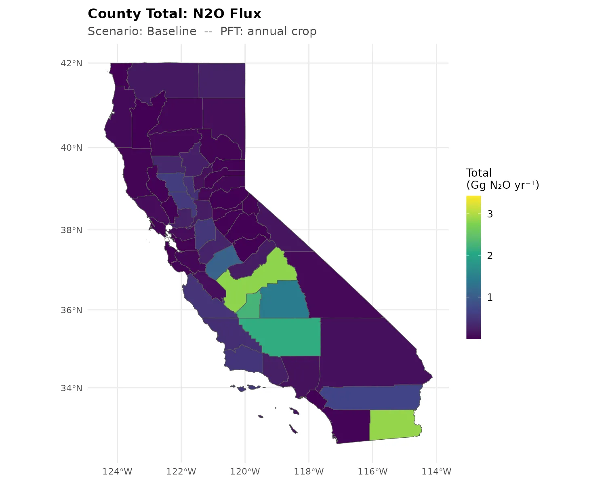
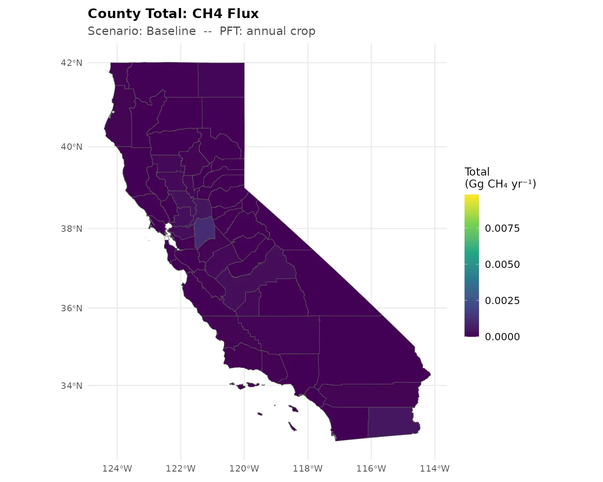
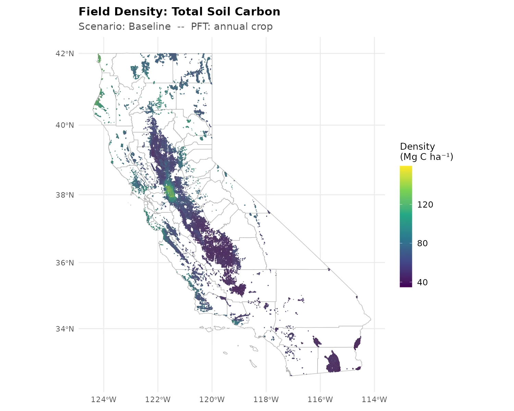
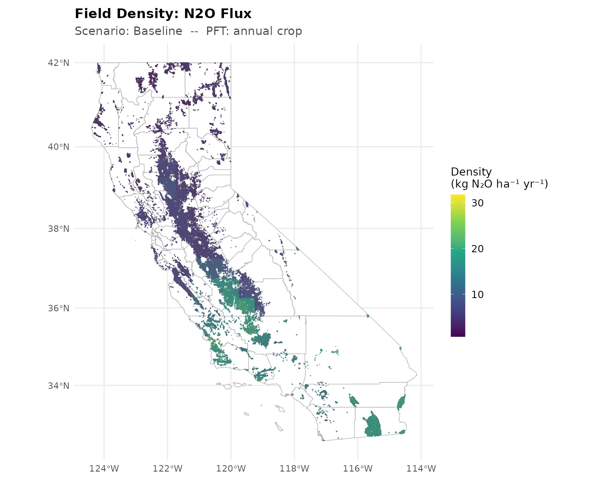
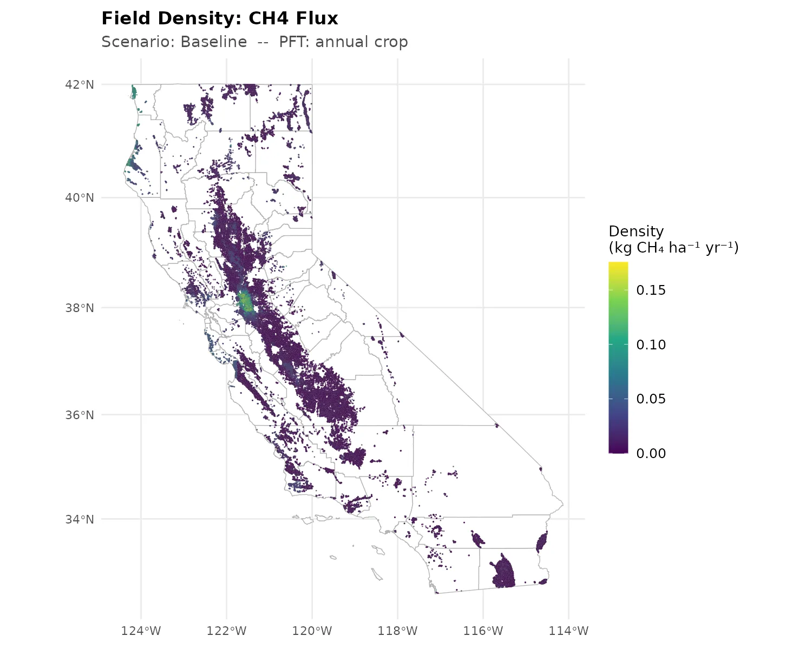
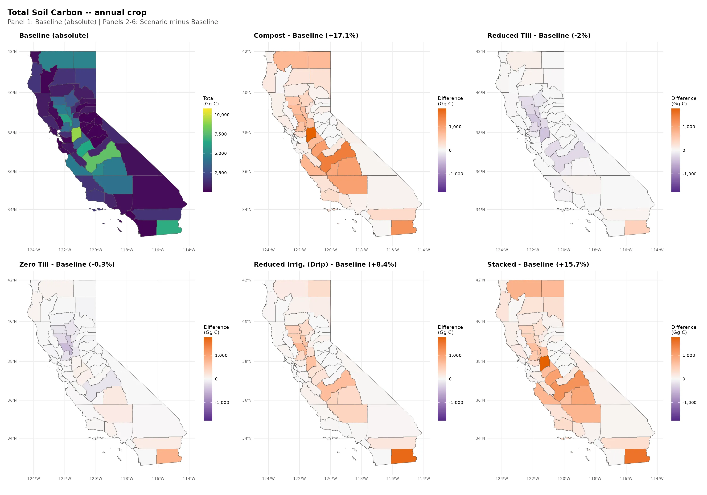
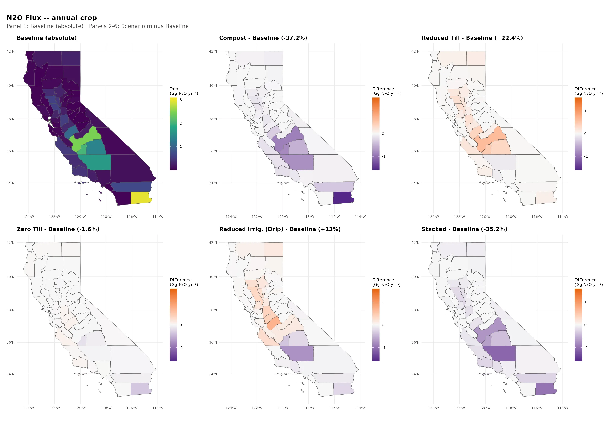
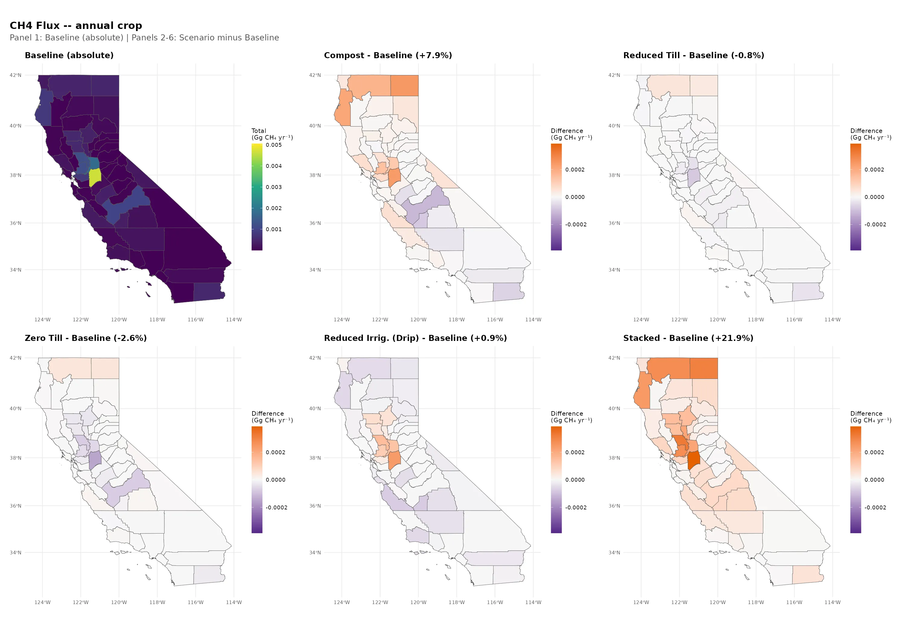

```{r setup, include=FALSE}
options(ccmmf.quiet_banner = TRUE)
source(here::here("000-config.R"))
```

## Overview

This page presents baseline results from the Random Forest downscaling of SIPNET model outputs from 100 anchor sites to approximately 132,000 annual cropland fields across 57 California counties. Results include county-level totals, field-level density maps, and mixed baseline-plus-scenario-difference comparisons for soil carbon, aboveground biomass, and GHG fluxes (N~2~O, CH~4~). For detailed interpretation of scenario effects, see the [Soil Carbon Atlas](atlas_soil_carbon.qmd) and [GHG Emissions Atlas](atlas_ghg_emissions.qmd).

::: {.callout-warning}
## Validation Status

These results are from a proof-of-concept modeling framework that has not been validated against field observations. Interpret all values as illustrative projections, not empirical estimates.
:::

For detailed information about methods and workflow, see the [Workflow Documentation](../docs/workflow_documentation.md).

## County-Level Baseline Carbon Stocks

County-level maps show the total mass summed across all annual cropland fields in each county. Central Valley counties (Kern, Fresno, Tulare, San Joaquin) dominate because they contain the most cropland area. Units are Gg (gigagrams) for carbon pools and Gg yr⁻¹ for GHG fluxes.

### Soil Carbon (TotSoilCarb)

{.lightbox group="county-baseline" fig-alt="Baseline county total soil carbon map showing highest stocks in Central Valley counties"}

The spatial pattern reflects county-level cropland area more than per-hectare soil properties. Kern, Fresno, and Tulare counties show the highest totals because they contain the largest share of California's annual cropland. See the [field-level density maps](#field-level-baseline-density) below for the per-hectare view that isolates soil and climate effects from area.

### Aboveground Biomass (AGB)

{.lightbox group="county-baseline" fig-alt="Baseline county total aboveground biomass map"}

AGB in annual croplands reflects standing biomass at the modeled time point. Values are very small compared to soil carbon pools because annual crops are harvested. AGB is most useful as a relative indicator of crop productivity differences across regions.

### Nitrous Oxide (N~2~O) Flux

{.lightbox group="county-baseline" fig-alt="Baseline county total N2O emission map showing highest emissions in southern Central Valley and Imperial Valley"}

N~2~O emissions are highest in the southern San Joaquin Valley (Kern, Tulare, Kings, Fresno) and Imperial County. This pattern reflects the combined influence of large cropland areas and warmer temperatures that promote nitrification and denitrification. The north-south gradient in per-hectare N~2~O emission rates is driven by temperature and vapor pressure (see [Model Drivers](atlas_model_drivers.qmd)).

### Methane (CH~4~) Flux

{.lightbox group="county-baseline" fig-alt="Baseline county CH4 emission map showing near-zero values across all counties"}

::: {.callout-warning}
## CH~4~ Is Effectively Zero

Non-flooded annual croplands produce negligible CH~4~ because methanogenesis requires sustained anaerobic conditions (continuous flooding) that do not occur under standard irrigation. The statewide total of 0.014 Gg CH~4~ yr⁻¹ is effectively machine-precision zero in the process model. Any spatial pattern in this map reflects noise in the downscaling model (OOB R² = -0.15), not real ecological variation. Meaningful CH~4~ fluxes are expected when rice paddies are included in future model runs.
:::

## Field-Level Baseline Density {#field-level-baseline-density}

Area-normalized density (per hectare) at the individual field level isolates per-area effects from county cropland area. These maps reveal how soil type, climate, and topography drive spatial variation independent of how much cropland each county contains.

### Soil Carbon (TotSoilCarb)

{.lightbox group="field-baseline" fig-alt="Baseline field-level soil carbon density map showing higher per-hectare values in Sacramento Valley"}

Sacramento Valley fields (north) tend to show higher per-hectare soil carbon than San Joaquin Valley fields (south), consistent with cooler temperatures slowing organic matter decomposition. This gradient is driven primarily by organic carbon density (ocd) and vapor pressure (vapr) -- see [Model Drivers](atlas_model_drivers.qmd).

### Aboveground Biomass (AGB)

{.lightbox group="field-baseline" fig-alt="Baseline field-level AGB density map"}

### Nitrous Oxide (N~2~O) Flux

{.lightbox group="field-baseline" fig-alt="Baseline field-level N2O flux density map showing north-south gradient with higher emissions in warmer southern fields"}

Per-hectare N~2~O emissions show a clear north-south gradient: southern fields (Imperial Valley, southern San Joaquin) emit 20--30 kg N~2~O ha⁻¹ yr⁻¹ while northern fields emit 5--10 kg N~2~O ha⁻¹ yr⁻¹. This gradient reflects the strong temperature and vapor pressure dependence of soil N~2~O production through nitrification and denitrification pathways.

### Methane (CH~4~) Flux

{.lightbox group="field-baseline" fig-alt="Baseline field-level CH4 flux density map showing near-zero values"}

All field-level CH~4~ values are effectively zero (0.007 kg CH~4~ ha⁻¹ yr⁻¹ statewide average). Any spatial variation is noise from the downscaling model, not a real ecological signal.

## Mixed Comparison: Baseline + Scenario Differences

These panels show the baseline map alongside the five scenario difference maps for each variable. The first panel uses an absolute scale; panels 2--6 use a diverging scale centered on zero. See the [Scenario Definition Table](atlas_overview.qmd#tbl-scenario-def) for practice parameters and simulation details. For detailed interpretation, see the [Soil Carbon Atlas](atlas_soil_carbon.qmd) and [GHG Emissions Atlas](atlas_ghg_emissions.qmd).

### Soil Carbon (TotSoilCarb)

{.lightbox group="mixed" fig-alt="Mixed comparison showing baseline soil carbon alongside scenario differences: compost +12.2%, stacked +16.6%, drip +3.3%, tillage small positive"}

All five management scenarios increase soil carbon relative to baseline. Compost (+12.2%) and stacked (+16.6%) show the largest gains. See [Soil Carbon Atlas](atlas_soil_carbon.qmd) for detailed scenario analysis.

### Aboveground Biomass (AGB)

{.lightbox group="mixed" fig-alt="Mixed comparison showing baseline AGB alongside scenario differences: tillage and compost no change, drip and stacked -18.6%"}

Compost and tillage scenarios show no AGB change (0%). Drip irrigation and stacked scenarios show -18.6% AGB reduction, reflecting altered water availability affecting end-of-season residue.

### Nitrous Oxide (N~2~O) Flux

{.lightbox group="mixed" fig-alt="Mixed comparison showing baseline N2O alongside scenario differences: compost -39.5%, stacked -27.3%, drip +12.0%"}

Compost (-39.5%) and stacked (-27.3%) reduce N~2~O emissions. Drip irrigation (+12.0%) increases N~2~O. Tillage scenarios show essentially no change. See [GHG Emissions Atlas](atlas_ghg_emissions.qmd) for detailed trade-off analysis.

### Methane (CH~4~) Flux

{.lightbox group="mixed" fig-alt="Mixed comparison showing baseline CH4 alongside scenario differences -- all effectively zero"}

All CH~4~ values are effectively zero for non-flooded annual croplands. Percentage differences shown in panel titles are misleading because the baseline is machine-precision zero. See the [GHG Emissions Atlas](atlas_ghg_emissions.qmd) for discussion.

## Interactive Data Tables

### County Stocks and Density (Baseline)

```{r,load_inputs, message=FALSE, warning=FALSE}

# Load county aggregated predictions (baseline only for this overview page)
county_summaries <- readr::read_csv(
  file.path(model_outdir, "county_aggregated_preds.csv"),
  show_col_types = FALSE
) |>
  dplyr::filter(scenario == "baseline")

# Long table with PFT + area
county_summaries_table <- county_summaries |>
  dplyr::mutate(
    `Mean Total (Tg/county)` = paste0(signif(mean_total_per_county / 1e6, 2), " (", signif(sd_total_per_county / 1e6, 2), ")"),
    `Mean Density (Mg/ha)`   = paste0(signif(mean_density_per_ha, 2), " (", signif(sd_density_per_ha, 2), ")"),
    `Area (ha)`              = signif(mean_total_ha, 3)
  ) |>
  dplyr::rename(
    `Variable` = model_output,
    `PFT`      = pft,
    `County`   = county,
    `# Fields` = n
  ) |>
  dplyr::select(`Variable`, `PFT`, `County`, `# Fields`, `Area (ha)`, `Mean Total (Tg/county)`, `Mean Density (Mg/ha)`)

htmlwidgets::setWidgetIdSeed(123)

DT::datatable(
  county_summaries_table,
  extensions = c('Scroller','SearchPanes','Select'),
  options = list(
    dom = 'Plrtip',
    pageLength = 10,
    searchHighlight = FALSE,
    deferRender = TRUE,
    scroller = TRUE,
    scrollY = "60vh",
    searchPanes = list(cascadePanes = TRUE, initCollapsed = TRUE),
    columnDefs = list(list(searchPanes = list(show = TRUE), targets = c(0,1)))
  ),
  class = "stripe hover compact",
  rownames = FALSE, escape = FALSE
)

# Wide comparison: density by PFT
density_wide <- county_summaries |>
  dplyr::select(County = county, Variable = model_output, PFT = pft, `Density (Mg/ha)` = mean_density_per_ha) |>
  tidyr::pivot_wider(names_from = PFT, values_from = `Density (Mg/ha)`) |>
  dplyr::arrange(Variable, County)

# Drop rows where the row-wise max value is < MASK_THRESHOLD * colsum of the column where that max occurs,
# evaluated within each Carbon Pool separately
if (exists("MASK_THRESHOLD")) {
  mask_group <- function(df) {
    vals <- as.matrix(dplyr::select(df, -County, -Variable))
    vals2 <- vals; vals2[is.na(vals2)] <- -Inf
    col_sums <- colSums(vals, na.rm = TRUE)
    if (all(!is.finite(col_sums)) || sum(col_sums, na.rm = TRUE) <= 0) return(df)
    row_max_val <- apply(vals2, 1, max)
    row_max_col <- max.col(vals2, ties.method = "first")
    thresholds <- col_sums[row_max_col] * get0("MASK_THRESHOLD", ifnotfound = 0.01)
    keep <- is.finite(row_max_val) & row_max_val >= thresholds
    df[keep, , drop = FALSE]
  }
  density_wide <- density_wide |>
    dplyr::group_split(Variable, .keep = TRUE) |>
    purrr::map(mask_group) |>
    dplyr::bind_rows()
}

DT::datatable(
  density_wide,
  extensions = c('Scroller','SearchPanes','Select'),
  options = list(
    dom = 'Plrtip',
    pageLength = 10,
    searchHighlight = FALSE,
    deferRender = TRUE,
    scroller = TRUE,
    scrollY = "60vh",
    searchPanes = list(cascadePanes = TRUE, initCollapsed = TRUE),
    columnDefs = list(list(searchPanes = list(show = TRUE), targets = c(0,1)))
  ),
  class = "stripe hover compact",
  rownames = FALSE, escape = FALSE
)
```
