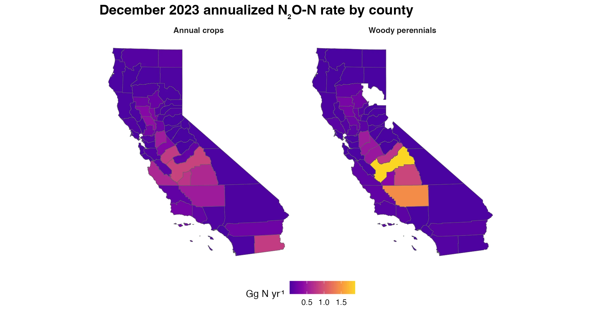
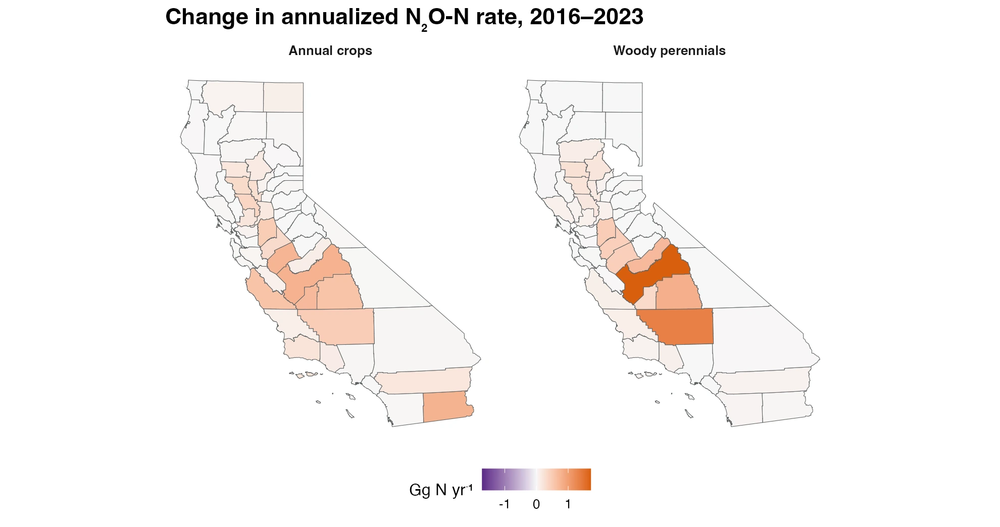

The historical inventory describes modeled conditions for California agricultural fields under recorded inputs from January 2016 through December 2023. Results summarize the agricultural fields represented in the downscaling dataset; they are not totals for all California land. County maps show modeled totals over represented fields, while field maps show area-normalized values.

These are model-derived results. The model has been minimally tested against site level observations and syntheses of available research.

## Historical inventory summary

The inventory covers annual crops and woody perennial crops under recorded historical inputs. Stock values are December 2023 monthly means. Nitrous-oxide and methane values are December 2023 annualized endpoint rates, not emissions integrated over 2016–2023.

| Outcome | Annual crops | Woody perennial crops | Unit and basis |
|---|---:|---:|---|
| Soil carbon | 113.22 (17.42) | 87.93 (16.56) | Tg C, December 2023 stock |
| Aboveground biomass | 4.64 (5.91) | 1,147.70 (314.60) | Gg C, December 2023 stock |
| N~2~O-N | 9.25 (8.28) | 9.06 (7.99) | Gg N yr^-1^, annualized endpoint rate |
| CH~4~-C | 0.0366 (0.1329) | 0.0244 (0.1012) | Gg C yr^-1^, annualized endpoint rate |

: Ensemble mean with standard deviation in parentheses. Totals apply to represented agricultural fields, not all California land. {#tbl-inventory-summary}

Soil carbon is the largest reported carbon pool. County totals reflect both the modeled stock density and the agricultural area represented within each county; field-density maps separate the per-hectare pattern from area. Woody perennial crops contain much more standing aboveground biomass than annual crops at the December endpoint.

The inventory maps indicate net soil-carbon declines over much of the represented area from 2016 to 2023. These changes are stock differences between endpoint monthly means. They are not annualized sequestration rates.

Nitrous-oxide results are reported in native nitrogen units. The maps show annualized December 2023 rates and changes in that endpoint rate. They should not be added directly to soil-carbon stock changes.

## Spatial context

{#fig-inventory-context .lightbox fig-alt="Map of California showing annual-crop and woody-perennial field locations represented in the downscaling analysis"}

Annual crops and woody perennial crops are presented separately because their carbon stocks, biomass, and spatial distributions differ substantially.

## Soil carbon

Soil carbon is reported as a stock. County maps sum modeled stocks across represented fields; field maps report carbon density per hectare. Historical changes compare January 2016 and December 2023 monthly means.

### County soil-carbon stocks

{#fig-inventory-soc-county .lightbox fig-alt="Paired California county maps showing December 2023 soil-carbon stocks for annual and woody perennial crops"}

The largest county totals occur where substantial represented agricultural area coincides with moderate or high modeled stock density. The annual and woody maps use the same units but should be interpreted separately because the crop classes occupy different fields.

### Field soil-carbon density

{#fig-inventory-soc-field .lightbox fig-alt="Paired California field maps showing December 2023 soil-carbon density for annual and woody perennial crops"}

Field density reveals spatial variation that is obscured by county totals. Northern and coastal agricultural regions generally show higher modeled density than many southern and interior fields, although variation occurs within each crop class.

### Soil-carbon change, 2016–2023

{#fig-inventory-soc-change .lightbox fig-alt="Paired California county maps showing soil-carbon stock changes between January 2016 and December 2023"}

Modeled soil-carbon stocks decline across much of the represented area over the historical period. The largest negative county changes occur in agricultural regions with substantial represented area. These values are endpoint stock differences in Gg C, not annualized rates or atmospheric removals.

## Nitrous oxide and gas-accounting scope

The historical inventory reports nitrous-oxide and methane outputs as annualized December endpoint rates. These rates describe the model state at the endpoint; they are not calendar-year integrals or cumulative emissions over 2016–2023.

### Nitrous-oxide endpoint rates

{#fig-inventory-n2o-county .lightbox fig-alt="Paired California county maps showing December 2023 annualized nitrous-oxide nitrogen rates for annual and woody perennial crops"}

County totals reflect both the modeled per-hectare rate and the represented agricultural area. The annual and woody crop classes have similar ensemble-mean totals at the December 2023 endpoint, but the spatial distributions differ.

### Change in endpoint rate, 2016–2023

{#fig-inventory-n2o-change .lightbox fig-alt="Paired California county maps showing change in annualized nitrous-oxide nitrogen rate from 2016 to 2023"}

Most represented counties show a higher modeled annualized endpoint rate in December 2023 than in January 2016. This is a change between two endpoint rates; it is not the total nitrogen emitted during the intervening years.

### Methane and complete gas accounting

Historical methane endpoint estimates are small relative to ensemble variability and do not support a useful spatial map. Complete annual gas series are not presented, so gas results are not combined with soil-carbon stock changes or converted to a partial CO~2~-equivalent total.

## Aboveground biomass

Aboveground biomass is the modeled carbon stock in living plant material above the soil surface. December values are endpoint snapshots rather than annual production totals. Annual-crop biomass is small at the endpoint because harvest removes much of the standing crop; woody perennial crops retain substantially more biomass.

### County aboveground biomass

{#fig-inventory-biomass-county .lightbox fig-alt="Paired California county maps showing December 2023 aboveground-biomass stocks for annual and woody perennial crops"}

Woody perennial biomass is concentrated in the Central Valley and other orchard-producing regions. Annual-crop endpoint totals are much smaller and should be interpreted as standing biomass at the December endpoint, not annual harvested production.

### Field biomass density

{#fig-inventory-biomass-field .lightbox fig-alt="Paired California field maps showing December 2023 aboveground-biomass density for annual and woody perennial crops"}

The field maps separate per-hectare modeled biomass from the amount of agricultural area within a county. Woody perennial fields have higher endpoint densities than annual-crop fields across most represented regions.

### Biomass change, 2016–2023

{#fig-inventory-biomass-change .lightbox fig-alt="Paired California county maps showing aboveground-biomass stock changes between January 2016 and December 2023"}

The historical endpoint comparison is predominantly negative, particularly for woody perennial crops in parts of the Central Valley. These changes describe modeled endpoint stocks and should not be interpreted as harvested yield or cumulative production.

## Interpretation

Ensemble ranges describe variation among parameter ensemble members; they are not observational confidence intervals. Soil-carbon stocks and changes are reported separately from gas fluxes, and native carbon or nitrogen units are retained where complete CO~2~-equivalent accounting is not available.

See [Scenario-Based Analysis](scenarios.qmd) for the 2024–2045 management and climate comparisons.
