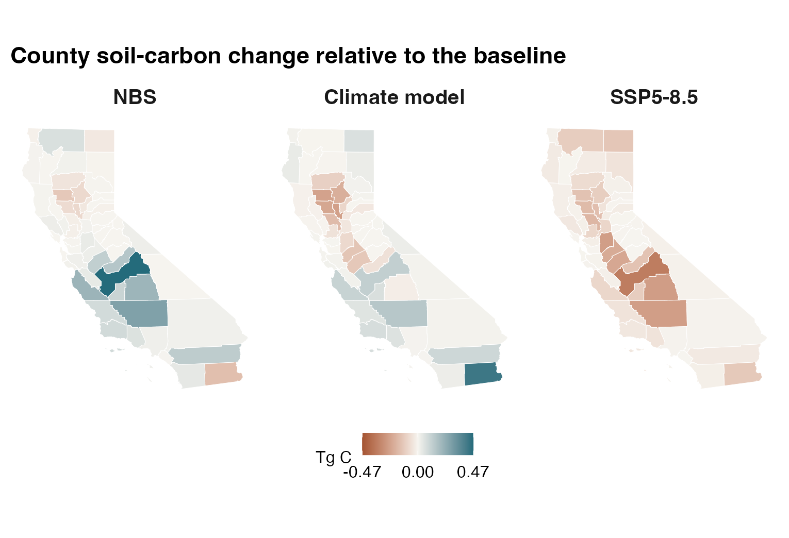

The analysis compares four scenarios through December 2045. CARB provided the
business-as-usual (BAU) and nature-based-solutions (NBS) management scenarios. The
baseline combines BAU management, the Community Earth System Model version 2 (CESM2),
and Shared Socioeconomic Pathway 3-7.0 (SSP3-7.0). Each alternative changes one
dimension relative to that baseline.

| Scenario | Management | Climate model | Pathway | Purpose |
|---|---|---|---|---|
| `bau-cesm-ssp370` | BAU | CESM2 | SSP3-7.0 | Baseline |
| `nbs-cesm-ssp370` | NBS | CESM2 | SSP3-7.0 | Management comparison |
| `bau-mpi-ssp370` | BAU | MPI-ESM1-2-HR | SSP3-7.0 | Climate-model comparison |
| `bau-cesm-ssp585` | BAU | CESM2 | SSP5-8.5 | Emissions-pathway comparison |

: Scenarios used in the 2024–2045 analysis. {#tbl-scenarios}

## Soil-carbon context

{#fig-soc-context .lightbox fig-alt="Two panels compare inventory and baseline-scenario soil-carbon stocks and changes for annual crops, woody perennial crops, and their sum. Faint points show each ensemble member; large points and bars show means and member spread."}

The negative baseline change may include adjustment from a non-stable initial state. Scenario effects are therefore evaluated primarily as matched differences from the baseline trajectory.

## Scenario effects relative to the baseline

| Contrast | Annual crops | Woody perennial crops | Statewide mean | Statewide median | Statewide p05–p95 |
|---|---:|---:|---:|---:|---:|
| `nbs-cesm-ssp370` minus baseline | 0.73 | 0.83 | 1.6 | 1.4 | -1.8 to 3.9 |
| `bau-mpi-ssp370` minus baseline | 0.36 | -0.77 | -0.41 | -0.58 | -5.1 to 3.8 |
| `bau-cesm-ssp585` minus baseline | -1.9 | -1.9 | -3.7 | -3.4 | -6.2 to -1.3 |

: Soil-carbon change relative to the baseline, Tg C. Contrasts preserve original ensemble-member identity before summarization. Positive values indicate more soil carbon relative to the baseline trajectory. {#tbl-soc-contrasts}

NBS retains an average of 1.6 Tg C more than the baseline trajectory by December 2045. Changing the climate model produces little change in the statewide mean but different annual- and woody-crop responses. SSP5-8.5 reduces soil carbon by an additional 3.7 Tg C relative to the baseline.

{#fig-scenario-soc-contrasts .lightbox fig-alt="Three California county maps compare NBS management, an alternate climate model, and SSP5-8.5 with the BAU baseline on one signed soil-carbon scale."}

## Scenario soil-carbon responses

{#fig-scenario-soc-statewide .lightbox fig-alt="Two horizontal panels showing statewide soil-carbon change for one baseline and three alternatives, followed by matched alternative-minus-baseline differences. Points show the twenty original ensemble members; boxplots show medians and interquartile ranges."}

| Scenario | Mean | Median | p05 | p95 |
|---|---:|---:|---:|---:|
| `bau-cesm-ssp370` | -45 | -47 | -98 | 18 |
| `nbs-cesm-ssp370` | -44 | -47 | -97 | 21 |
| `bau-mpi-ssp370` | -46 | -46 | -96 | 16 |
| `bau-cesm-ssp585` | -49 | -52 | -100 | 12 |

: Statewide December 2045 minus January 2024 soil-carbon stock, Tg C. {#tbl-soc-response}

## Inventory and scenario-based N~2~O-N

N~2~O-N is integrated over each calendar year and reported in kg N ha^-1^ yr^-1^. The inventory summarizes the mean of eight annual totals from 2016–2023. Scenario results use four five-year periods from 2025–2044. Each temporal mean is calculated within the original ensemble member before ensemble summaries or matched contrasts.

{#fig-inventory-scenario-n2o .lightbox fig-alt="Side-by-side annual N2O-N plots on the same 2025–2044 axis: BAU and NBS medians at left, member-matched NBS-minus-BAU difference at right. Thick lines show centered five-year moving means."}

| Inventory stratum | Mean | Median | p05–p95 |
|---|---:|---:|---:|
| Annual crops | 18 | 8.2 | 4.0 to 56 |
| Woody perennial crops | 20 | 7.8 | 3.8 to 63 |
| All crops | 19 | 8.0 | 3.9 to 60 |

: Inventory mean annual N~2~O-N, 2016–2023, kg N ha^-1^ yr^-1^. Values retain the original member distributions and apply to the covered agricultural fields. {#tbl-inventory-n2o}

| Period | Baseline mean | NBS mean | NBS minus baseline | Matched-member p05–p95 |
|---|---:|---:|---:|---:|
| 2025–2029 | 21 | 21 | 0.12 | -0.14 to 0.52 |
| 2030–2034 | 22 | 23 | 0.38 | -0.23 to 1.4 |
| 2035–2039 | 21 | 21 | 0.54 | 0.00 to 1.7 |
| 2040–2044 | 19 | 20 | 0.43 | 0.06 to 1.7 |

: Scenario mean annual N~2~O-N by five-year period, kg N ha^-1^ yr^-1^. Each member is averaged over the five years before ensemble means and matched-member ranges are calculated. {#tbl-annual-n2o}

The NBS mean is higher than the baseline in each period, but the matched-member range
spans zero through 2035–2039. The last period's range is entirely above zero.

## Methane change at matched locations with rice history

Modeled locations with at least one recorded rice season during 2016–2023 are eligible
for the methane comparison. We match locations and ensemble members between the BAU
and NBS scenarios, then calculate five-year means before averaging across locations.
This per-hectare comparison excludes locations present in only one scenario, so it does not
measure changes in rice acreage.

{#fig-scenario-ch4-direct .lightbox fig-alt="Annual NBS-minus-BAU methane flux at matched locations with rice history from 2025 to 2044, with a centered five-year moving mean."}

| Period | Mean | Median | p05–p95 |
|---|---:|---:|---:|
| 2025–2029 | 0.052 | 0.045 | -0.024 to 0.15 |
| 2030–2034 | 0.062 | 0.041 | 0.013 to 0.19 |
| 2035–2039 | 0.12 | 0.067 | 0.010 to 0.42 |
| 2040–2044 | 0.18 | 0.11 | 0.050 to 0.41 |

: NBS-minus-baseline methane flux at matched locations with rice history, g CH~4~ ha^-1^ yr^-1^. Period summaries retain all 20 ensemble members. {#tbl-direct-ch4}

These small per-hectare differences are not mapped or weighted by area and cannot be
summed into a statewide methane total.
