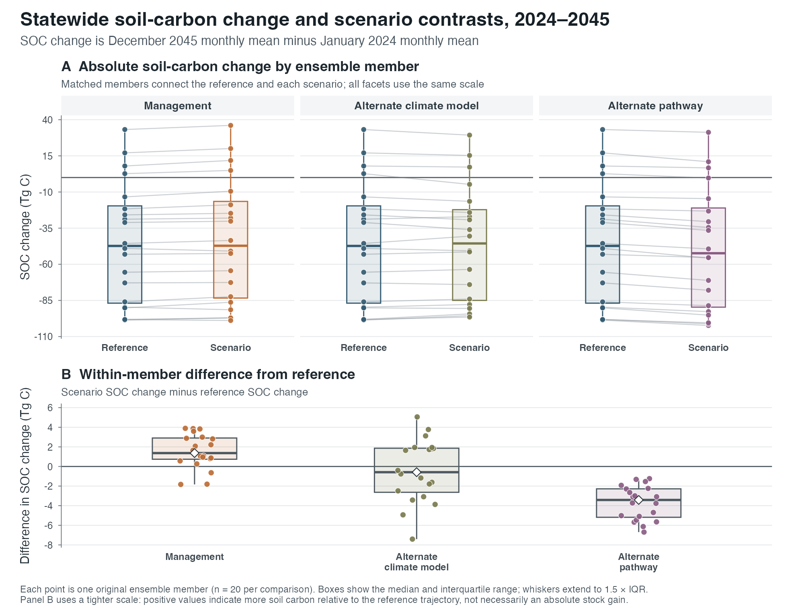
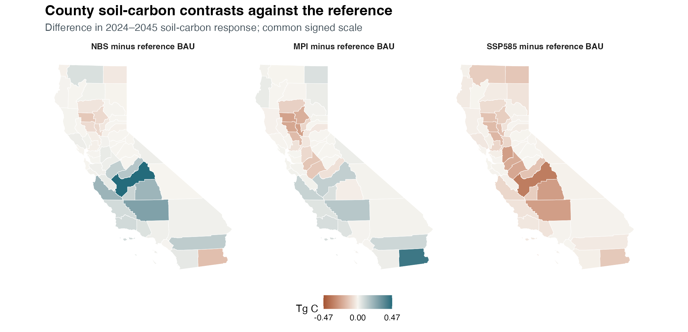
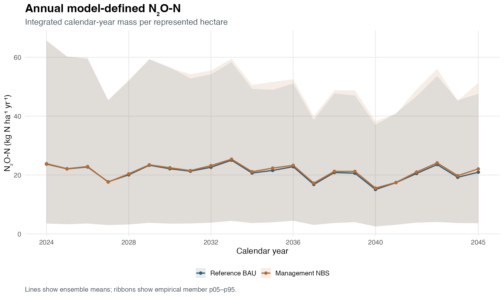
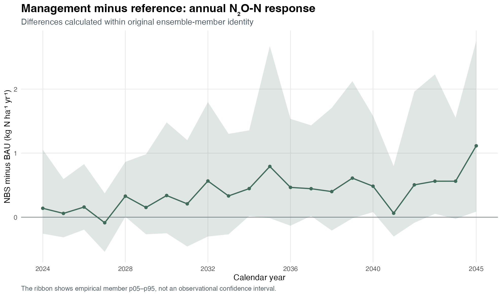

The scenario-based analysis compares four scenarios through December 2045. The reference uses business-as-usual management, CESM2 climate, and SSP370. Each alternative changes one dimension relative to the reference.

| Scenario | Management | Climate model | Pathway | Purpose |
|---|---|---|---|---|
| Reference | BAU | CESM2 | SSP370 | Reference scenario |
| Management | NBS | CESM2 | SSP370 | Management comparison |
| Climate model | BAU | MPI-ESM1-2-HR | SSP370 | Climate-model sensitivity |
| Pathway | BAU | CESM2 | SSP585 | Emissions-pathway sensitivity |

: Scenarios used in the 2024–2045 analysis. {#tbl-scenarios}

## Statewide soil-carbon response

{#fig-scenario-soc-statewide .lightbox fig-alt="Horizontal interval plot showing statewide soil-carbon response for reference, management, climate-model, and pathway scenarios"}

| Scenario | Mean | p05 | p95 |
|---|---:|---:|---:|
| Reference | -45.33 | -98.30 | 17.90 |
| Management | -43.77 | -97.21 | 20.86 |
| Climate model | -45.74 | -95.60 | 15.96 |
| Pathway | -49.04 | -100.55 | 12.00 |

: Statewide December 2045 minus January 2024 soil-carbon stock response, Tg C. {#tbl-soc-response}

All four ensemble means are negative, indicating modeled soil-carbon stock loss over the period. The ensemble ranges are parameter-member spread, not observational confidence intervals.

## Contrasts against the reference

{#fig-scenario-soc-contrasts .lightbox fig-alt="Three California county maps showing management, climate-model, and pathway soil-carbon contrasts against the reference scenario"}

| Contrast | Mean | p05 | p95 | Interpretation |
|---|---:|---:|---:|---|
| Management minus reference | 1.55 | -1.81 | 3.86 | Less modeled stock loss on average |
| Climate model minus reference | -0.41 | -5.06 | 3.84 | Similar statewide mean, with regional differences |
| Pathway minus reference | -3.71 | -6.16 | -1.31 | Greater modeled stock loss |

: Statewide soil-carbon response contrasts, Tg C. Contrasts are calculated within original ensemble-member identity before summarization. {#tbl-soc-contrasts}

The positive management contrast does not mean that statewide soil carbon increases. It means that the management scenario loses less soil carbon than the reference on average. The county maps show where each contrast contributes to the statewide result.

## Annual model-defined N~2~O-N

{#fig-scenario-n2o-annual .lightbox fig-alt="Line chart of annual model-defined nitrous-oxide nitrogen for reference and management scenarios from 2024 to 2045"}

Annual N~2~O-N is integrated over each calendar year and reported as native nitrogen mass per represented hectare. This differs from the historical inventory's annualized endpoint rate.

{#fig-scenario-n2o-contrast .lightbox fig-alt="Line chart of matched-member management-minus-reference annual nitrous-oxide nitrogen differences from 2024 to 2045"}

| Year | Reference | Management | Management minus reference |
|---:|---:|---:|---:|
| 2024 | 23.71 | 23.85 | 0.14 |
| 2030 | 22.13 | 22.47 | 0.34 |
| 2035 | 21.54 | 22.33 | 0.79 |
| 2040 | 15.06 | 15.54 | 0.48 |
| 2045 | 20.94 | 22.06 | 1.11 |

: Selected annual N~2~O-N means, kg N ha^-1^ yr^-1^. {#tbl-annual-n2o}

The management mean is higher than the reference in most years, but the matched-member spread commonly crosses zero. These modeled differences do not establish an observed causal management effect.

## Gas-reporting boundary

Annual native-N accounting is available for the reference and management scenarios. Corrected statewide methane and complete annual gas series for the climate-model and pathway scenarios are not shown. Soil-carbon stock changes and the available gas results are therefore reported separately rather than combined into an incomplete CO~2~-equivalent balance.
